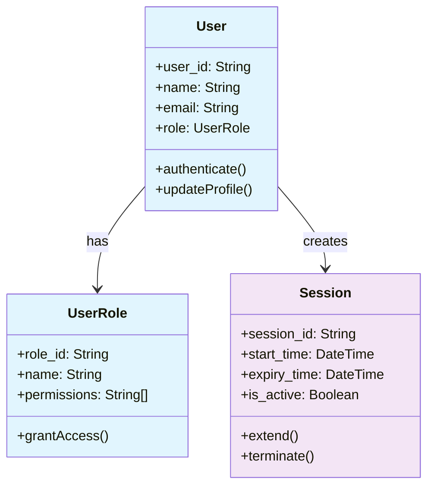
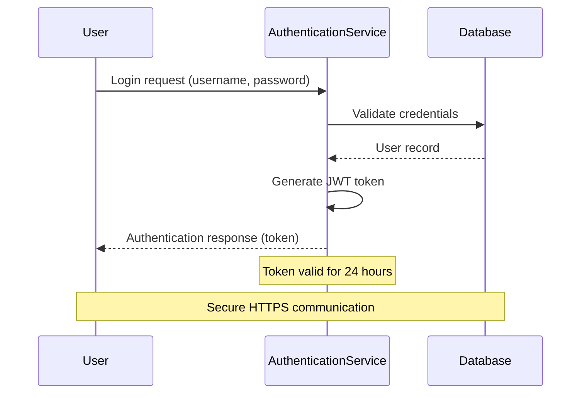
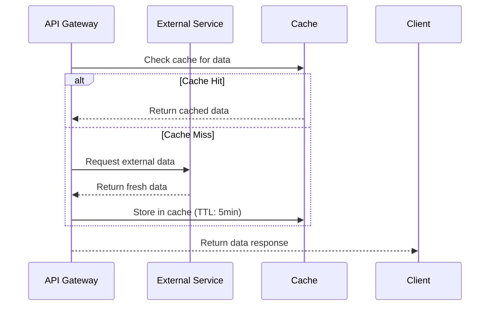
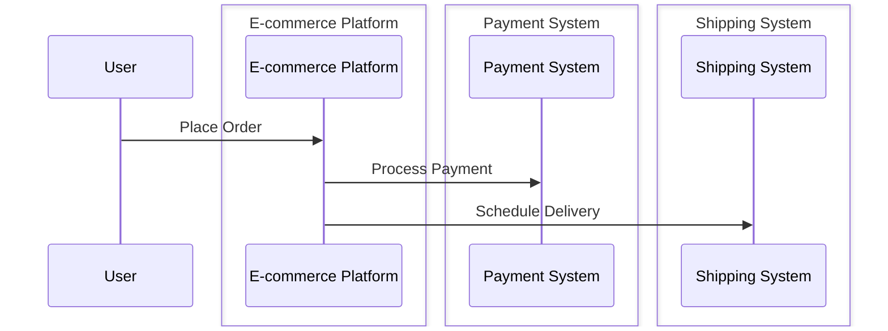

# Diagram Generate Collaboration

Generate visual collaboration diagrams from domain analysis to illustrate system interactions, user workflows, entity relationships, and domain models using Mermaid syntax embedded in markdown.

## Intent
Transform analyzed domain concepts and requirements into clear, actionable collaboration diagrams that visualize key system interactions, user journeys, cross-system workflows, and domain entity relationships. Focus on communicating complex relationships through standardized diagram patterns.

## Inputs
- **Primary**: `projects/[project-name]/artifacts/Analysis/domain-concepts.json` (from domain-extractconcepts skill)
- **Secondary**: `projects/[project-name]/artifacts/Analysis/requirements.json` (from requirements-ingest skill)
- **Tertiary**: `orgModel/**/domain-model.md` (existing domain models for class diagram generation)
- **Optional**: `projects/[project-name]/artifacts/Analysis/goals.json` (from goals-extract skill)
- **Format**: Structured domain entities, relationships, and requirements data

## Outputs
**Files Generated:**
- `projects/[project-name]/artifacts/Analysis/collaboration-diagrams.md` - Markdown with embedded Mermaid diagrams
- `projects/[project-name]/artifacts/Analysis/collaboration-diagrams.json` - Structured diagram metadata
- `orgModel/**/domain-model.md` - Updated organizational domain models with embedded class diagrams (when domain-model integration is requested)

### Markdown Structure (`collaboration-diagrams.md`)
```markdown
# Collaboration Diagrams

**Project**: [project_id]  
**Generated**: [timestamp]  
**Source**: domain-concepts.json, requirements.json

## Domain Class Model

### Entity Relationship Overview *(Diagram D-001)*
**Source Requirements**: [R-001], [R-003]  
**Domain Source**: orgModel/01-skill-dev/domain-model.md



## User-System Interactions

### Authentication Flow *(Diagram D-002)*
**Source Requirements**: [R-001], [R-003]  
**Entities Involved**: User, AuthenticationService, Database




### [Additional User-System Diagrams...]

## System-System Interactions

### API Integration Flow *(Diagram D-002)*
**Source Requirements**: [R-005], [R-007]  
**Entities Involved**: APIGateway, ExternalService, Cache



### [Additional System-System Diagrams...]

## Hierarchical Collaboration Diagrams

### System Boundary View *(Diagram D-005)*
**Source Requirements**: [R-010]
**Decomposition**: `01-ECommerce-Platform/collaboration.md`



## Process Workflows

### [Business Process Diagrams...]
```

### JSON Structure (`collaboration-diagrams.json`)
```json
{
  "project_id": "string",
  "generation_metadata": {
    "generated_at": "ISO8601",
    "source_files": ["domain-concepts.json", "requirements.json"],
    "total_diagrams": "number",
    "diagram_types": ["class", "sequence", "flowchart", "stateDiagram"]
  },
  "diagrams": [
    {
      "id": "D-001",
      "title": "Entity Relationship Overview", 
      "type": "class",
      "category": "domain-model",
      "description": "Core domain entities and their relationships",
      "entities": ["User", "UserRole", "Session"],
      "source_requirements": ["R-001", "R-003"],
      "mermaid_code": "classDiagram...",
      "complexity": "medium",
      "maintenance_priority": "high"
    },
    {
      "id": "D-002",
      "title": "Authentication Flow", 
      "type": "sequence",
      "category": "user-system",
      "description": "User authentication and JWT token generation",
      "entities": ["User", "AuthenticationService", "Database"],
      "source_requirements": ["R-001", "R-003"],
      "mermaid_code": "sequenceDiagram...",
      "complexity": "medium",
      "maintenance_priority": "high"
    }
  ]
}
```

## Processing Workflow

### 1. Input Analysis
**From `domain-concepts.json`:**
- Extract entities with their relationships
- Identify domain areas and key processes
- Map entity interactions and dependencies

**From `requirements.json`:**
- Find interaction patterns in requirement text
- Identify user journeys and system flows
- Extract temporal sequences and decision points

**For Hierarchical Diagrams (Optional):**
- Identify participant stereotypes (`<<Actor>>`, `<<System>>`, `<<UI>>`, `<<Entity>>`) from domain concepts
- **Classify participants** using stereotype inference rules (see Participant Stereotype Classification)
- Detect boundary definitions from configuration or automatic analysis
- Map decomposition links between parent and child diagrams
- **Validate decomposition eligibility** — only control-type participants may become sub-processes
- **Validate boundary-first reception** — boundary-type participants must receive actor messages first

### 2. Diagram Type Selection
**Domain Class Models:**
- Use class diagrams to visualize entity relationships and domain structure
- Include core entities with attributes and operations
- Show inheritance, composition, and association relationships
- Add styling to distinguish entity types (actors, core entities, enums)

**User-System Interactions:**
- Use sequence diagrams for user workflows
- Include system responses and error paths
- Show authentication, authorization flows

**System-System Interactions:**
- Use sequence diagrams for API communications
- Include timeouts, retries, and failure scenarios
- Show data flow between services

**Business Process Workflows:**
- Use flowcharts for decision trees and branching logic
- Include parallel processes and synchronization points
- Show approval workflows and state transitions

**Hierarchical Diagrams:**
- Use `box` syntax to represent system boundaries
- Generate Level 0 diagrams showing high-level system interactions
- Decompose `<<System>>` participants into Level 1+ diagrams
- Follow EDPS decomposition rules for participant stereotypes
- **Apply stereotype classification** to all participants before generating diagrams
- **Enforce decomposition rules** — block decomposition of non-control participants

### 3. Mermaid Generation Rules

**Class Diagrams:**
```
classDiagram
    class [EntityName]:::[styleCategory] {
        +attribute_name: Type
        -private_attribute: Type
        +operation_name()
        -private_operation()
    }
    
    [SourceEntity] --> [TargetEntity] : relationship_label
    [ParentEntity] <|-- [ChildEntity]
    [CompositeEntity] *--> [ComponentEntity]
    [AggregateEntity] o--> [PartEntity]
    
    %% Styling Definitions
    classDef [styleCategory] fill:#[color]
    classDef actor fill:#e1f5fe
    classDef entity fill:#f3e5f5
    classDef enum fill:#fff3e0
    classDef ai fill:#e8f5e8
```

**Naming Conventions for Class Diagrams:**
- Entity names: PascalCase (User, UserProfile, PaymentGateway)
- Attributes: snake_case (user_id, created_at, is_active)
- Methods: camelCase (authenticate(), updateProfile(), calculateTotal())
- Relationships: Use clear, descriptive labels
- Styling: Use inline styling with :::styleCategory syntax PLUS classDef definitions
- Style categories: actor, entity, enum, ai (or custom categories as needed)
- Standard colors: actor (#e1f5fe), entity (#f3e5f5), enum (#fff3e0), ai (#e8f5e8)

**Sequence Diagrams:**
```
participant [ShortName] as [Full Entity Name]
[Actor]->>+[Target]: [Action description]
[Target]-->>-[Actor]: [Response description]
Note over [Entity]: [Important information]
alt [Condition]
    [Alternative flow]
else [Other condition]
    [Alternative flow]
end
```

**Naming Conventions:**
- Entity names: PascalCase (UserService, PaymentGateway)
- Messages: Action-oriented (Validate credentials, Process payment)
- Notes: Clarify business rules, timeouts, constraints
- Alt blocks: Show error handling and edge cases

**Hierarchical Sequence Diagrams (with Boundaries):**
```
sequenceDiagram
    participant [ActorName]@{ "type": "actor", "label": "[Full Actor Name]" }
    
    box [BoundaryName]
        participant [ParticipantName]@{ "type": "[boundary|control|entity]", "label": "[Full Participant Name]" }
        ...
    end
    
    [Actor]->>[Participant]: [Interaction]
```

**Naming and Stereotype Conventions:**
- Use `@{ "type" : "..." }` syntax to define participant stereotypes
- **actor**: External participants, cannot be decomposed
- **boundary**: Entry point to a boundary (e.g., UI, API Gateway)
- **control**: Decomposable system/service component
- **entity**: Stable data store or resource
- Boundary names should reflect the encapsulated capability
- See **Participant Stereotype Classification** section for inference and enforcement rules

### 4. Traceability Integration
**Requirement References:**
- Link each diagram to source requirements using `[R-XXX]` format
- Include entity references using `ENT-XXX` identifiers from domain concepts
- Maintain bidirectional traceability for change impact analysis
- Reference domain models using `orgModel/**/*domain-model.md` paths for class diagrams

**Diagram Metadata:**
- Assign unique diagram IDs (`D-001`, `D-002`, etc.)
- Track complexity level (simple/medium/complex)
- Set maintenance priority based on business criticality
- Category classification: domain-model, user-system, system-system, process-workflow

**For Hierarchical Diagrams:**
- Add `decomposition` field in diagram metadata to link to child diagrams
- Ensure participant names are consistent across hierarchy levels
- Propagate requirement traceability down the decomposition chain

## Participant Stereotype Classification

Every participant in a hierarchical collaboration diagram must be classified into exactly one of four stereotypes. Classification drives annotation generation, decomposition eligibility, and message routing validation.

### Stereotype Definitions

| Stereotype | `@{ "type" }` value | Role | Decomposable? |
|-----------|---------------------|------|---------------|
| Actor | `actor` | External entity that initiates interactions | No |
| Boundary | `boundary` | Interface mediator between actors and internal components | No |
| Control | `control` | Business logic / orchestration component | **Yes** |
| Entity | `entity` | Data store or passive resource | No |

### Automatic Type Inference Rules

When a participant does not have an explicit stereotype, the skill infers its type using the following ordered heuristic rules:

1. **Actor inference** — A participant is classified as `actor` when:
   - It appears **outside all `box` boundaries**
   - It only **initiates** interactions (sends first messages) and never receives unsolicited internal messages
   - Its name matches common actor patterns: *User*, *Customer*, *Client*, *Admin*, *External*, *Partner*
   - It has a `<<Actor>>` stereotype tag in domain concepts

2. **Boundary inference** — A participant is classified as `boundary` when:
   - It is the **first participant inside a `box`** to receive a message from an external actor
   - Its name matches interface patterns: *UI*, *API*, *Gateway*, *Portal*, *Interface*, *Handler*, *Endpoint*, *Facade*
   - It primarily **mediates** between external actors and internal components
   - It has a `<<UI>>` stereotype tag in domain concepts

3. **Entity inference** — A participant is classified as `entity` when:
   - It primarily **receives** data operation messages (CRUD: store, retrieve, query, update, delete)
   - Its name matches data patterns: *DB*, *Database*, *Repository*, *Store*, *Cache*, *Registry*, *Storage*, *Table*, *Queue*
   - It **does not initiate** complex orchestration sequences
   - It has a `<<Entity>>` stereotype tag in domain concepts

4. **Control inference (default)** — A participant is classified as `control` when:
   - It does **not** match actor, boundary, or entity patterns
   - It performs **business logic**, orchestration, or coordination
   - Its name matches service patterns: *Service*, *Manager*, *Processor*, *Engine*, *Handler*, *Coordinator*, *Orchestrator*, *Validator*
   - It has a `<<System>>` stereotype tag in domain concepts
   - **Fallback**: any participant that cannot be classified by the above rules defaults to `control`

### Manual Type Override

Explicit type specification always takes precedence over inference. Types can be set via:

**Input JSON:**
```json
{
  "participants": [
    { "name": "OrderService", "stereotype": "control" },
    { "name": "AuditLog", "stereotype": "entity" },
    { "name": "AdminPortal", "stereotype": "boundary" }
  ]
}
```

**Inline annotation (already in diagram):**
```
participant OrderService@{ "type": "control", "label": "Order Service" }
```

When a manual override conflicts with inferred type, the override wins and a note is added to the diagram metadata:
```json
{
  "type_overrides": [
    { "participant": "AuditLog", "inferred": "control", "override": "entity", "reason": "manual" }
  ]
}
```

### Mermaid Annotation Generation

After classification, every participant definition in the Mermaid output must include the `@{ "type": "..." }` annotation:

```
sequenceDiagram
    participant Customer@{ "type": "actor", "label": "Customer" }
    
    box Order Processing
        participant API@{ "type": "boundary", "label": "Order API" }
        participant OrderSvc@{ "type": "control", "label": "Order Service" }
        participant OrderDB@{ "type": "entity", "label": "Order Database" }
    end
    
    Customer->>API: Place Order
    API->>OrderSvc: Process Order
    OrderSvc->>OrderDB: Store Order
```

**Generation rules:**
- Always include both `"type"` and `"label"` keys in the annotation object
- `"type"` must be one of: `actor`, `boundary`, `control`, `entity`
- `"label"` should be the human-readable display name
- Actors are declared **before** any `box` block
- Boundary participants are declared **first** inside their `box` block

### Decomposition Rule Enforcement

Before generating a decomposition (sub-process diagram) for any participant, the skill **must** validate decomposition eligibility:

#### Rule 1: Control-Only Decomposition
- **Only** participants with `"type": "control"` may be decomposed into sub-process diagrams
- Attempting to decompose an `actor`, `boundary`, or `entity` participant **must** produce a validation error

**Validation output on violation:**
```json
{
  "validation_errors": [
    {
      "rule": "control-only-decomposition",
      "participant": "CustomerDB",
      "type": "entity",
      "message": "Cannot decompose participant 'CustomerDB' (type: entity). Only control-type participants can be decomposed into sub-processes.",
      "suggestion": "If this participant requires internal detail, consider reclassifying it as 'control' or modeling its internals as a separate entity-focused diagram."
    }
  ]
}
```

#### Rule 2: Boundary-First Reception
- Within any `box` boundary, the **first message from an external actor** must be received by a `boundary`-type participant
- If no boundary-type participant exists in a box, a validation warning is generated
- If an actor sends a message directly to a `control` or `entity` participant inside a box, a validation error is generated

**Valid pattern:**
```
Customer (actor) ->> API (boundary) ->> Service (control) ->> DB (entity)
```

**Invalid pattern (produces error):**
```
Customer (actor) ->> Service (control)   ❌ skips boundary
```

**Validation output on violation:**
```json
{
  "validation_errors": [
    {
      "rule": "boundary-first-reception",
      "boundary": "Order Processing",
      "actor": "Customer",
      "received_by": "OrderService",
      "received_by_type": "control",
      "message": "Actor 'Customer' sends directly to 'OrderService' (type: control) inside boundary 'Order Processing'. Messages from actors must be received by a boundary-type participant first.",
      "suggestion": "Add or designate a boundary-type participant (e.g., API Gateway) as the entry point for this boundary."
    }
  ]
}
```

#### Rule 3: Actor Externality
- `actor`-type participants must **never** appear inside a `box` boundary
- Actors must be declared at the top level, before any `box` block

#### Rule 4: Entity Stability
- `entity`-type participants **should not** be decomposed
- Entities represent stable data/resource concerns; if internal detail is needed, model it as a separate entity-relationship diagram rather than a process decomposition

### Type Consistency Across Hierarchy Levels

When a participant is decomposed from Level N to Level N+1:
- The **parent participant** at Level N retains its original type annotation
- The **decomposed diagram** at Level N+1 introduces new participants with their own type classifications
- The **entry point** in the Level N+1 diagram should be a `boundary`-type participant matching the parent's external interface
- Type classifications must be **consistent** — a participant classified as `control` at Level N cannot appear as `entity` at Level N+1

### Participant Type Summary

After classification, the skill generates a type summary in the diagram metadata:

```json
{
  "participant_type_summary": {
    "total_participants": 8,
    "by_type": {
      "actor": { "count": 2, "participants": ["Customer", "Admin"] },
      "boundary": { "count": 2, "participants": ["WebUI", "AdminPortal"] },
      "control": { "count": 3, "participants": ["OrderService", "PaymentService", "NotificationService"] },
      "entity": { "count": 1, "participants": ["OrderDB"] }
    },
    "decomposable": ["OrderService", "PaymentService", "NotificationService"],
    "type_overrides": [],
    "inference_confidence": {
      "high": ["Customer", "WebUI", "OrderDB"],
      "medium": ["OrderService", "PaymentService"],
      "low": ["NotificationService"]
    }
  }
}
```

### Classification Input Parameters

```json
{
  "stereotype_classification": true,
  "auto_inference": true,
  "manual_overrides": [
    { "participant": "AuditLog", "type": "entity" }
  ],
  "enforce_decomposition_rules": true,
  "enforce_boundary_first_reception": true,
  "generate_type_summary": true
}
```

## Box Syntax Generation

This section defines how the skill generates Mermaid `box ... end` syntax blocks for boundary grouping in hierarchical sequence diagrams. All rules in this section apply whenever `hierarchical_decomposition: true` or explicit boundaries are configured.

### Core Box Syntax Template

Every boundary is rendered as a `box` block. External actors are declared **before** all box blocks; participants inside a boundary appear inside the corresponding `box ... end` block:

```
sequenceDiagram

    %% External participants (actors) — outside all boundaries
    participant [ActorName]@{ "type": "actor", "label": "[Human-readable Actor Label]" }

    %% Boundary: [BoundaryName]
    box [BoundaryName]
        participant [BoundaryParticipant]@{ "type": "boundary", "label": "[Label]" }
        participant [ControlParticipant1]@{ "type": "control", "label": "[Label]" }
        participant [ControlParticipant2]@{ "type": "control", "label": "[Label]" }
        participant [EntityParticipant1]@{ "type": "entity", "label": "[Label]" }
    end

    %% Interactions
    [ActorName]->>[BoundaryParticipant]: [Action]
    ...
```

**Generation rules:**
- All `actor`-type participants are emitted **before** any `box` block
- Each boundary produces exactly one `box [BoundaryName] ... end` block
- Box blocks are separated by a blank line plus a `%% Boundary:` comment for readability
- Mermaid does not support nested `box` blocks; decomposition to sub-boundaries is expressed through separate diagrams linked by decomposition references

### Participant Ordering Within a Box

Participants inside each `box` block must follow a strict ordering to satisfy EDPS boundary rules and produce readable diagrams:

| Order | Stereotype | Rationale |
|-------|-----------|-----------|
| 1st | `boundary` | First recipient of actor messages; entry point to boundary |
| 2nd–Nth | `control` | Business logic components; eligible for further decomposition |
| Last | `entity` | Data / resource stores; passive, no first-message routing needed |

**Example of correct ordering:**
```
box Payment Service Boundary
    participant Gateway@{ "type": "boundary", "label": "Payment Gateway" }
    participant Processor@{ "type": "control", "label": "Transaction Processor" }
    participant Validator@{ "type": "control", "label": "Payment Validator" }
    participant Ledger@{ "type": "entity", "label": "Transaction Ledger" }
end
```

If a boundary contains **no** `boundary`-type participant, emit a validation warning and list all `control` participants first, followed by `entity` participants.

### Multi-Boundary Generation

Multiple non-overlapping boundaries are supported in a single sequence diagram. Each gets its own `box` block, declared in order of first interaction:

```
sequenceDiagram

    participant Customer@{ "type": "actor", "label": "Customer" }

    %% Boundary: E-commerce Platform
    box E-commerce Platform Boundary
        participant Web@{ "type": "boundary", "label": "Web Frontend" }
        participant Order@{ "type": "control", "label": "Order Service" }
        participant Inventory@{ "type": "control", "label": "Inventory Service" }
        participant CustomerDB@{ "type": "entity", "label": "Customer Database" }
    end

    %% Boundary: Payment System
    box Payment System Boundary
        participant PayAPI@{ "type": "boundary", "label": "Payment API" }
        participant TxProcessor@{ "type": "control", "label": "Transaction Processor" }
        participant Ledger@{ "type": "entity", "label": "Transaction Ledger" }
    end

    %% Boundary: Fulfillment Center
    box Fulfillment Center Boundary
        participant FulfillAPI@{ "type": "boundary", "label": "Fulfillment API" }
        participant Warehouse@{ "type": "control", "label": "Warehouse Manager" }
        participant Shipment@{ "type": "entity", "label": "Shipment Record" }
    end

    Customer->>Web: Place Order
    Web->>Order: Create Order
    Order->>PayAPI: Process Payment
    Order->>FulfillAPI: Schedule Delivery
```

**Multi-boundary constraints:**
- Participants cannot belong to more than one boundary block
- Boundaries must be non-overlapping; if a conflict is detected during generation, report a validation error
- Recommended maximum of **5 boundaries** per diagram for readability; beyond 5, consider splitting into multiple diagrams
- Order of `box` blocks follows the sequence of first message receipt by each boundary

### Boundary Naming Conventions

Boundary names are derived automatically from context using the following priority order:

| Priority | Source | Example Output |
|----------|--------|----------------|
| 1 | Manual `name` in input configuration | `"Payment Gateway"` → `Payment Gateway` |
| 2 | Domain concept name + `" Boundary"` suffix | concept `OrderManagement` → `Order Management Boundary` |
| 3 | Dominant participant name + type suffix | primary control `CreditChecker` → `Credit Check Service Boundary` |
| 4 | Functional role inference from participant names | names contain `inventory`, `stock` → `Inventory Management Boundary` |
| 5 | Generic fallback with ordinal | `System Boundary 1`, `System Boundary 2` |

**Naming formatting rules:**
- Use Title Case for all boundary names
- Append `" Boundary"` suffix to system/component names; omit suffix for naturally scoped phrases that are already descriptive (e.g., `E-commerce Platform`)
- Avoid acronyms unless they are widely understood in the project domain
- Maximum name length: 50 characters; truncate with `...` if exceeded

### Boundary Color and Styling

Boundaries support optional color customization. Colors are applied via Mermaid's `box` color parameter:

```
box rgb(235, 245, 255) E-commerce Platform Boundary
    participant Web@{ "type": "boundary", "label": "Web Frontend" }
    ...
end
```

**Default color palette (applied round-robin when `auto_color: true`):**

| Boundary Index | Color | RGB Value | Semantic Meaning |
|---------------|-------|-----------|-----------------|
| 1st boundary | Light blue | `rgb(235, 245, 255)` | Primary system |
| 2nd boundary | Light green | `rgb(235, 255, 240)` | Secondary system |
| 3rd boundary | Light amber | `rgb(255, 250, 235)` | Supporting system |
| 4th boundary | Light lavender | `rgb(245, 235, 255)` | Integration layer |
| 5th+ boundary | Light grey | `rgb(245, 245, 245)` | Additional systems |

**Styling configuration:**
```json
{
  "boundary_styling": {
    "auto_color": true,
    "manual_colors": {
      "Payment System Boundary": "rgb(255, 243, 224)",
      "Security Boundary": "rgb(255, 235, 235)"
    }
  }
}
```

When `auto_color: false` (default) and no `manual_colors` are provided, the `box` keyword is used without a color parameter.

### Boundary Summary Comments

When `generate_boundary_comments: true` is set (recommended), the skill inserts structured comments into the Mermaid output to improve readability and navigation:

```
sequenceDiagram
    %% ─────────────────────────────────────────────────────
    %% BOUNDARY SUMMARY
    %% ─────────────────────────────────────────────────────    
    %% [B-1] E-commerce Platform Boundary
    %%         Participants: Web Frontend (boundary), Order Service (control),
    %%                       Inventory Service (control), Customer Database (entity)
    %%         Decomposable: Order Service, Inventory Service
    %%         External actor: Customer
    %%
    %% [B-2] Payment System Boundary
    %%         Participants: Payment API (boundary), Transaction Processor (control),
    %%                       Transaction Ledger (entity)
    %%         Decomposable: Transaction Processor
    %%         External actor: none (called from E-commerce Platform)
    %% ─────────────────────────────────────────────────────

    participant Customer@{ "type": "actor", "label": "Customer" }

    %% [B-1] E-commerce Platform Boundary
    box E-commerce Platform Boundary
        ...
    end

    %% [B-2] Payment System Boundary
    box Payment System Boundary
        ...
    end
```

### Edge Case Handling

| Edge Case | Detection | Handling |
|-----------|-----------|----------|
| **Single participant boundary** | Only one participant inside a `box` block | Emit a warning in metadata; still generate the box; suggest merging with a related boundary |
| **External participants between boxes** | Participants not assigned to any boundary | Declare outside all `box` blocks; include in `external_participants` metadata list |
| **No `boundary`-type participant in box** | Box contains only `control`/`entity` participants | Emit validation warning; list controls first, entities last; add `%% WARNING: No boundary-type entry point` comment inside the box |
| **Empty boundary** | Boundary configured with zero participants | Skip generation; emit error `empty-boundary-skipped` in metadata |
| **Duplicate participant across boundaries** | Same participant ID appears in two boxes | Emit validation error `duplicate-participant`; use first boundary assignment; suggest renaming |
| **More than 5 boundaries** | `boundary_count > 5` | Emit readability warning; continue generation; recommend splitting into multiple diagrams |

### Box Syntax Configuration Parameters

```json
{
  "box_syntax": {
    "enabled": true,
    "participant_ordering": "boundary-control-entity",
    "generate_boundary_comments": true,
    "boundary_naming": {
      "strategy": "domain-concept-first",
      "suffix": "Boundary",
      "title_case": true
    },
    "boundary_styling": {
      "auto_color": false,
      "manual_colors": {}
    },
    "validation": {
      "enforce_participant_ordering": true,
      "warn_single_participant_boundary": true,
      "error_on_empty_boundary": true,
      "warn_no_boundary_type_entry_point": true,
      "error_on_duplicate_participant": true,
      "warn_exceeds_boundary_count": 5
    }
  }
}
```

### Box Syntax Metadata Output

After box syntax generation the skill emits a `box_syntax_metadata` block in `collaboration-diagrams.json`:

```json
{
  "box_syntax_metadata": {
    "total_boundaries": 3,
    "boundaries": [
      {
        "id": "B-1",
        "name": "E-commerce Platform Boundary",
        "color": null,
        "participants": {
          "boundary": ["Web"],
          "control": ["Order", "Inventory"],
          "entity": ["CustomerDB"]
        },
        "decomposable_participants": ["Order", "Inventory"],
        "external_actors": ["Customer"],
        "warnings": []
      },
      {
        "id": "B-2",
        "name": "Payment System Boundary",
        "color": null,
        "participants": {
          "boundary": ["PayAPI"],
          "control": ["TxProcessor"],
          "entity": ["Ledger"]
        },
        "decomposable_participants": ["TxProcessor"],
        "external_actors": [],
        "warnings": []
      }
    ],
    "external_participants": [],
    "validation_errors": [],
    "validation_warnings": []
  }
}
```

## Boundary Validation

This section defines the complete set of boundary validation rules, the two execution modes (strict vs advisory), and the machine-readable validation report format emitted by the skill. Boundary validation runs as a **pre-render check** after participant classification and box syntax generation, and before final Mermaid output is written.

### Overview

All hierarchical collaboration diagrams produced by this skill are validated against four EDPS boundary rules. Each rule can independently raise an **error** (hard violation) or a **warning** (advisory issue) depending on the active mode.

| Rule ID | Rule Name | Default Severity |
|---------|-----------|-----------------|
| VR-1 | Single External Interface | Error |
| VR-2 | Boundary-First Reception | Error |
| VR-3 | Control-Only Decomposition | Error |
| VR-4 | Cohesive Responsibility | Warning |

---

### Rule VR-1: Single External Interface

**Requirement**: Each boundary must have exactly one external actor sending messages directly into it. Multiple external actors communicating directly with internal boundary participants violates EDPS encapsulation principles.

**Valid:**
```
Customer (actor) ->> API (boundary) [inside Order Boundary]
```

**Invalid:**
```
Customer (actor)  ->> API     [inside Order Boundary]  ✅
Admin (actor)     ->> Service [inside Order Boundary]  ❌  second actor enters boundary directly
```

**Detection logic:**
- Collect all message senders that are `actor`-type and outside the boundary
- If `count(distinct external actors sending into boundary) > 1` → violation

**Validation output on violation:**
```json
{
  "rule": "VR-1",
  "rule_name": "single-external-interface",
  "severity": "error",
  "boundary": "Order Processing Boundary",
  "actors_found": ["Customer", "Admin"],
  "message": "Boundary 'Order Processing Boundary' is accessed by 2 external actors (Customer, Admin). Only one external actor may interact directly with a boundary.",
  "suggestion": "Split into two separate boundaries — one per external actor — or introduce a shared entry-point gateway that aggregates actor messages before forwarding into a single boundary."
}
```

---

### Rule VR-2: Boundary-First Reception

**Requirement**: Within any `box` boundary, the first message sent from an external actor must be received by a `boundary`-type participant. Actors must not bypass the boundary-type entry point and send directly to `control` or `entity` participants.

**Valid:**
```
Customer (actor) ->> Gateway (boundary) ->> OrderService (control)
```

**Invalid:**
```
Customer (actor) ->> OrderService (control)   ❌  skips boundary-type entry point
```

**Detection logic:**
- For each boundary, identify the first inbound message from an external actor
- Check the receiver's type; if it is not `boundary` → violation

**Validation output on violation:**
```json
{
  "rule": "VR-2",
  "rule_name": "boundary-first-reception",
  "severity": "error",
  "boundary": "Order Processing Boundary",
  "actor": "Customer",
  "received_by": "OrderService",
  "received_by_type": "control",
  "message": "Actor 'Customer' sends directly to 'OrderService' (type: control) inside boundary 'Order Processing Boundary'. The first recipient inside a boundary must be a boundary-type participant.",
  "suggestion": "Add or designate a boundary-type participant (e.g., 'Order API' or 'Order Portal') as the single entry point. Route the actor message through that participant first."
}
```

---

### Rule VR-3: Control-Only Decomposition

**Requirement**: Only participants with `type: control` may be decomposed into sub-process diagrams. Attempting to decompose an `actor`, `boundary`, or `entity` participant is a structural violation.

**Valid:**
```
decompose: OrderService (control)  ✅
```

**Invalid:**
```
decompose: OrderDB (entity)        ❌
decompose: API (boundary)          ❌
decompose: Customer (actor)        ❌
```

**Detection logic:**
- For each participant listed in `decomposable` or referenced as a sub-diagram root
- If participant type ≠ `control` → violation

**Validation output on violation:**
```json
{
  "rule": "VR-3",
  "rule_name": "control-only-decomposition",
  "severity": "error",
  "participant": "OrderDB",
  "participant_type": "entity",
  "message": "Cannot decompose participant 'OrderDB' (type: entity). Only control-type participants are eligible for sub-process decomposition.",
  "suggestion": "If this participant requires internal detail, reclassify it as 'control', or model its internal structure as a separate entity-relationship class diagram rather than a process decomposition."
}
```

---

### Rule VR-4: Cohesive Responsibility

**Requirement**: All participants grouped inside a `box` boundary should share related functionality or capability. Mixing unrelated concerns (e.g., database queries, email sending, and user authentication) inside a single boundary is a cohesion violation.

**Detection logic (heuristic):**
- Extract domain area tags or functional keywords from each participant's label and domain-concept entry
- Compute pairwise similarity across participants in the boundary
- If `min_cohesion_score < 0.3` (configurable) → warning
- Cohesion check is advisory by default; it does not block diagram generation

**Validation output on violation:**
```json
{
  "rule": "VR-4",
  "rule_name": "cohesive-responsibility",
  "severity": "warning",
  "boundary": "Mixed Services Boundary",
  "participants": ["QueryEngine", "EmailSender", "AuthHandler"],
  "cohesion_score": 0.18,
  "message": "Boundary 'Mixed Services Boundary' contains participants with unrelated functional concerns (query, email, authentication). Low cohesion score: 0.18.",
  "suggestion": "Refactor into separate boundaries — e.g., 'Data Access Boundary' (QueryEngine), 'Notification Boundary' (EmailSender), 'Security Boundary' (AuthHandler) — to enforce single-responsibility encapsulation."
}
```

---

### Validation Modes

The boundary validation pipeline supports two modes controlling how violations affect diagram generation:

#### Strict Mode (`validation_mode: "strict"`)
- **Errors** (VR-1, VR-2, VR-3 violations) **block** diagram generation
- The skill returns a validation report and does **not** produce Mermaid output
- Displays a clear error message identifying which rule was violated and where
- **Warnings** (VR-4 violations) are included in the report but do not block output
- Use this mode in automated pipelines or CI/CD environments where diagram correctness is mandatory

#### Advisory Mode (`validation_mode: "advisory"`)  *(default)*
- All violations (errors and warnings) are **reported** but do **not** block diagram generation
- Mermaid output is generated; validation findings are embedded as structured comments inside the output and in the JSON report
- Violation comments are injected inline in the Mermaid source at the point of violation:
  ```
  %% [VR-2 ERROR] Actor 'Customer' bypasses boundary-type entry point → OrderService (control)
  Customer->>OrderService: Place Order
  ```
- Use this mode during iterative modeling sessions where diagrams may be intentionally incomplete

**Mode configuration:**
```json
{
  "boundary_validation": {
    "validation_mode": "advisory",
    "rules": {
      "VR-1": { "enabled": true, "severity": "error" },
      "VR-2": { "enabled": true, "severity": "error" },
      "VR-3": { "enabled": true, "severity": "error" },
      "VR-4": { "enabled": true, "severity": "warning", "cohesion_threshold": 0.3 }
    }
  }
}
```

---

### Validation Report Format

After validation the skill emits a `boundary_validation_report` block in `collaboration-diagrams.json` and a matching markdown summary in `collaboration-diagrams.md`.

#### Machine-Readable JSON Report

```json
{
  "boundary_validation_report": {
    "validation_mode": "advisory",
    "validated_at": "2026-03-14T10:00:00Z",
    "overall_status": "PASS_WITH_WARNINGS",
    "summary": {
      "total_boundaries_checked": 3,
      "passed": 2,
      "failed": 0,
      "warnings": 1,
      "errors": 0
    },
    "rule_results": [
      {
        "rule": "VR-1",
        "rule_name": "single-external-interface",
        "status": "PASS",
        "boundaries_checked": 3,
        "violations": []
      },
      {
        "rule": "VR-2",
        "rule_name": "boundary-first-reception",
        "status": "PASS",
        "boundaries_checked": 3,
        "violations": []
      },
      {
        "rule": "VR-3",
        "rule_name": "control-only-decomposition",
        "status": "PASS",
        "participants_checked": 7,
        "violations": []
      },
      {
        "rule": "VR-4",
        "rule_name": "cohesive-responsibility",
        "status": "WARNING",
        "boundaries_checked": 3,
        "violations": [
          {
            "severity": "warning",
            "boundary": "Mixed Services Boundary",
            "participants": ["QueryEngine", "EmailSender", "AuthHandler"],
            "cohesion_score": 0.18,
            "message": "Boundary 'Mixed Services Boundary' contains participants with unrelated functional concerns.",
            "suggestion": "Refactor into separate boundaries by functional domain."
          }
        ]
      }
    ],
    "blocking_errors": [],
    "diagram_generation_blocked": false
  }
}
```

**`overall_status` values:**

| Status | Meaning |
|--------|---------|
| `PASS` | All rules passed with no violations |
| `PASS_WITH_WARNINGS` | No errors; one or more warnings |
| `FAIL` | One or more error-level violations (only in strict mode blocks generation) |
| `BLOCKED` | Diagram generation blocked due to errors in strict mode |

#### Markdown Validation Summary

The skill embeds a formatted validation summary section in `collaboration-diagrams.md` directly above the first diagram:

```markdown
## Boundary Validation Summary

**Validated**: 2026-03-14T10:00:00Z  
**Mode**: Advisory  
**Overall Status**: ⚠️ PASS WITH WARNINGS

| Rule | Name | Status | Details |
|------|------|--------|---------|
| VR-1 | Single External Interface | ✅ PASS | 3 boundaries checked |
| VR-2 | Boundary-First Reception | ✅ PASS | 3 boundaries checked |
| VR-3 | Control-Only Decomposition | ✅ PASS | 7 participants checked |
| VR-4 | Cohesive Responsibility | ⚠️ WARNING | 1 boundary has low cohesion |

### Warnings

**[VR-4] Cohesive Responsibility — Mixed Services Boundary**  
Participants with unrelated concerns: QueryEngine, EmailSender, AuthHandler (cohesion score: 0.18)  
*Suggestion*: Refactor into separate boundaries by functional domain.
```

---

### Validation Configuration Parameters

```json
{
  "boundary_validation": {
    "enabled": true,
    "validation_mode": "advisory",
    "inject_inline_comments": true,
    "generate_markdown_summary": true,
    "rules": {
      "VR-1": {
        "enabled": true,
        "severity": "error",
        "description": "Each boundary must have exactly one external actor interface"
      },
      "VR-2": {
        "enabled": true,
        "severity": "error",
        "description": "Boundary-type participant must be first recipient of actor messages"
      },
      "VR-3": {
        "enabled": true,
        "severity": "error",
        "description": "Only control-type participants may be decomposed"
      },
      "VR-4": {
        "enabled": true,
        "severity": "warning",
        "cohesion_threshold": 0.3,
        "description": "All boundary participants should share related functional concerns"
      }
    }
  }
}
```

---

### Validation Pipeline Integration

Boundary validation is integrated into the diagram generation pipeline at the **pre-render** stage:

```
1. Input Analysis              ← load domain-concepts.json + requirements.json
2. Participant Classification  ← stereotype inference + manual overrides
3. Box Syntax Generation       ← generate box blocks with participant ordering
4. ► Boundary Validation ◄     ← run VR-1 through VR-4 against generated structure
     ├── strict mode  → block generation on errors; return validation report only
     └── advisory mode → annotate output with violations; continue generation
5. Mermaid Output Generation   ← render final diagram with optional violation comments
6. Validation Report Emit      ← write boundary_validation_report to JSON + markdown
```

## Quality Guidelines

### Readability Standards
- **Class diagrams**: Limit to 10-15 entities maximum for clarity
- **Sequence diagrams**: Limit to 8-10 participants maximum  
- For hierarchical diagrams, Level 0 should have 2-5 boundaries
- Use meaningful, business-friendly entity names
- Include essential attributes and methods only
- Include notes for non-obvious business rules
- Show both happy path and key error scenarios

### Technical Standards  
- Valid Mermaid syntax that renders in VS Code
- Consistent naming conventions across all diagram types
- Appropriate use of visibility markers (+/- for public/private)
- Clear distinction between inheritance, composition, and association
- Proper use of inline styling with :::category syntax AND corresponding classDef definitions
- Consistent participant naming across related diagrams
- Appropriate use of activation boxes for long-running operations
- Clear distinction between synchronous and asynchronous calls
- For hierarchical diagrams, validate against EDPS boundary rules (e.g., single external interface)

### Business Value
- **Class diagrams**: Focus on core business entities and critical relationships
- **Interaction diagrams**: Focus on high-value interactions that need visualization
- Prioritize user-facing workflows and critical system integrations
- Include compliance and security-related flows
- Show cross-system dependencies that affect architecture decisions
- Ensure domain models align with organizational standards and terminology
- Use boundaries to model complex systems and hide internal details, improving clarity for different stakeholders

## Usage Pattern
```
1. Call after domain-extractconcepts skill completion
2. Load domain-concepts.json and requirements.json
3. **Optional**: Provide boundary configuration for hierarchical diagrams
4. Review existing orgModel domain models for class diagram context
5. Generate domain class diagrams showing entity relationships and structure
6. Generate collaboration diagrams for key interaction patterns
   - For hierarchical, generate Level 0 and decomposed child diagrams
7. Output markdown file with embedded Mermaid diagrams and JSON metadata
8. Update project documentation with visual collaboration and domain models
9. For domain model integration: Update orgModel/**/domain-model.md with generated class diagrams
```

## Hierarchical Decomposition Mode
When called with `hierarchical_decomposition: true`, this skill:

1. **Analyzes participant stereotypes** and interaction patterns to detect boundaries
2. **Generates a Level 0 diagram** with high-level system boundaries
3. **Decomposes each `<<System>>` participant** into a separate Level 1 collaboration diagram in a corresponding subfolder
4. **Creates a folder structure** that mirrors the decomposition hierarchy
5. **Maintains traceability** and context across all levels

### Hierarchical Input Parameters
```json
{
  "hierarchical_decomposition": true,
  "root_diagram_name": "SystemOverview",
  "auto_boundary_detection": true,
  "manual_boundaries": [
    {
      "name": "Payment Gateway",
      "participants": ["PaymentAPI", "TransactionProcessor"]
    }
  ]
}
```

## Domain Model Integration Mode
When called with `domain_model_integration: true`, this skill:

1. **Extracts existing domain model structure** from `orgModel/**/domain-model.md`
2. **Generates enhanced class diagrams** based on textual domain descriptions
3. **Updates domain-model.md** by adding or replacing the "Domain Class Diagram" section
4. **Maintains consistency** with existing textual domain descriptions
5. **Preserves traceability** links to requirements and domain concepts

### Integration Input Parameters
```json
{
  "domain_model_integration": true,
  "target_domain_model": "orgModel/01-skill-dev/domain-model.md",
  "diagram_placement": "after_title|before_actors|replace_existing",
  "sync_with_text": true
}
```

## Integration Notes
- **Domain Model Sync**: Class diagrams complement and enhance textual domain models
- **Cross-Skill Integration**: Works with domain-extractconcepts, domain-alignentities, and orgmodel-update
- **Bidirectional Updates**: Can generate diagrams from text or update text from aligned concepts
- **Organizational Standards**: Domain class diagrams align with organizational domain model standards
- **Iterative Refinement**: Supports incremental updates as requirements and domain understanding evolve
- **VS Code Compatible**: All diagrams render properly in VS Code Mermaid preview

## Cross-Skill Workflow Integration

### With domain-extractconcepts:
- Consume `domain-concepts.json` as primary input
- Generate class diagrams from extracted entities and relationships
- Maintain entity IDs and traceability to source requirements

### With domain-alignentities:
- Use alignment results to update class diagrams with organizational standards
- Incorporate entity mappings and terminology standardization
- Reflect alignment recommendations in diagram structure

### With orgmodel-update:
- Coordinate domain-model.md updates to avoid conflicts
- Ensure diagram updates align with organizational model changes
- Support rollback capabilities for diagram modifications