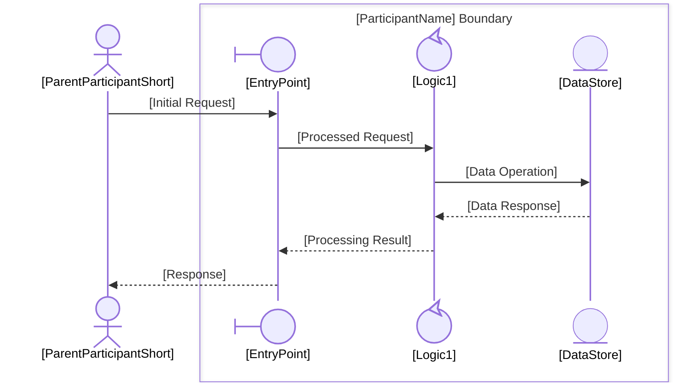
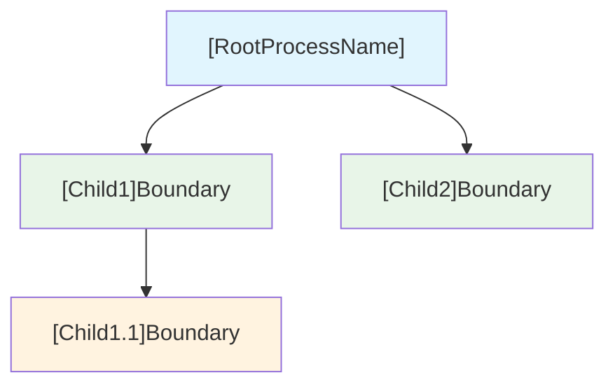
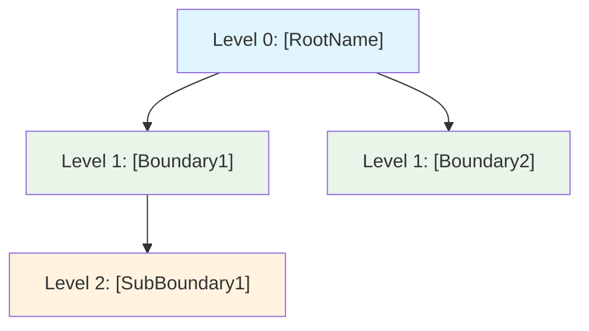

````skill
---
name: hierarchy-management
description: Manage hierarchical process decomposition in EDPS collaboration diagrams. Decomposes control-type participants into Level N+1 sub-processes with their own collaboration diagrams, tracks parent-child relationships across unlimited hierarchy depth, manages the folder structure, and maintains hierarchy metadata. Use when a user wants to decompose a participant into a sub-process, navigate a process hierarchy, roll back a decomposition, view hierarchy statistics, or generate a hierarchy tree visualization.
---

# Hierarchy Management

Decompose control-type participants into sub-process diagrams and manage the full hierarchy tree across EDPS collaboration models.

## Inputs

- **Parent diagram**: `[process-folder]/collaboration.md` — the diagram containing the participant to decompose
- **Target participant**: name of the control-type participant to decompose
- **Optional**: `[process-folder]/hierarchy-metadata.json` — existing hierarchy metadata

## Outputs

- `[process-folder]/[NN]-[ParticipantName]Boundary/collaboration.md` — new Level N+1 diagram
- `[process-folder]/[NN]-[ParticipantName]Boundary/main.md` — sub-process overview with parent/child navigation links
- `[process-folder]/[NN]-[ParticipantName]Boundary/process.md` — activity/workflow diagram for the sub-process
- `[process-folder]/[NN]-[ParticipantName]Boundary/domain-model.md` — class diagram with entities and relationships
- `[process-folder]/hierarchy-metadata.json` — updated hierarchy metadata (created if absent)
- `[process-folder]/folder-creation.log` — audit log appended with each sub-folder created
- Updated navigation links in parent `main.md` and `collaboration.md`

## Workflow

### 1. Validate Decomposition Eligibility

Before creating anything:

1. Read the parent `collaboration.md`
2. Identify the target participant's `@{ "type": "..." }` annotation
3. **If type ≠ `control`** → stop and return:

```json
{
  "error": "control-only-decomposition",
  "participant": "[Name]",
  "type": "[actual-type]",
  "message": "Only control-type participants can be decomposed into sub-processes.",
  "suggestion": "If this participant requires internal detail, consider reclassifying it as 'control', or model its internals as a separate diagram rather than a process decomposition."
}
```

4. Check whether a sub-folder for this participant already exists (decomposition already performed) → warn the user and offer to update instead

### 2. Determine Level and Folder Name

- Detect the current level by inspecting `hierarchy-metadata.json` at the parent level (or counting parent folder depth)
- Assign a two-digit ordinal prefix: count existing sub-folders in the parent directory and increment (e.g., `01`, `02`, `03`)
- Folder name pattern: `[NN]-[ParticipantNamePascalCase]Boundary`

Example: decomposing `OrderService` at Level 1 → `01-OrderServiceBoundary/`

#### 2a. Special Character Sanitization

Before building the folder name, sanitize the participant name:

| Rule | Input Example | Sanitized Output |
|------|--------------|-----------------|
| Remove spaces (PascalCase join) | `Order Service` | `OrderService` |
| Remove or replace `/` `\` `:` `*` `?` `"` `<` `>` `\|` | `Order/Service` | `OrderService` |
| Remove leading/trailing hyphens and dots | `.OrderService.` | `OrderService` |
| Collapse consecutive non-alphanumeric sequences to single hyphen | `Order--Service` | `OrderService` |
| Preserve existing PascalCase casing | `OrderServiceBoundary` | `OrderServiceBoundary` |

The final folder name must match the regex `^\d{2}-[A-Za-z][A-Za-z0-9]*Boundary$`.

#### 2b. Naming Collision Resolution

Before creating the folder, check whether `[NN]-[ParticipantName]Boundary/` already exists **in the same parent directory**:

1. **Exact match exists** (same ordinal + same name): the decomposition was already performed.
   - Stop and ask the user: "Sub-folder `[NN]-[ParticipantName]Boundary/` already exists. Do you want to (a) skip creation and reuse the existing folder, (b) overwrite its generated files, or (c) cancel?"
2. **Name match but different ordinal** (e.g., user renamed the folder): treat as a new decomposition — assign the next available ordinal.
3. **Ordinal conflict only** (different name, same number): increment the proposed ordinal until a free slot is found.

---

## Stub File Specification

When `hierarchy-management` creates a new sub-process folder, it writes **stub files only** — minimal-content placeholders that are syntactically valid Markdown and Mermaid but contain no generated process knowledge. Stub files pass `hierarchy-validation` rule HN-2 (Required Files Present) immediately after creation.

Full content generation is exclusively the responsibility of `documentation-automation`. Once `documentation-automation` has run, it replaces these stubs with content-complete documents.

**Machine-detectable stub marker**: Every stub file contains the exact substring `[TO BE GENERATED - invoke documentation-automation]`. The Content Guard in `documentation-automation` uses this substring to distinguish stubs from generated files.

### `main.md` Stub

```markdown
# [ParticipantName] Boundary

**Level**: [N+1]  
**Parent Process**: [[ParentProcessName]](../main.md)  
**Status**: Draft

## Navigation

**Breadcrumb**: [TO BE GENERATED - invoke documentation-automation]

**Parent Process**: [[ParentProcessName]](../main.md)

**Sub-Processes**: [TO BE GENERATED - invoke documentation-automation]

## Overview

[TO BE GENERATED - invoke documentation-automation]

## Collaboration Diagram

See [collaboration.md](collaboration.md)

## Process Flow

See [process.md](process.md)

## Domain Model

See [domain-model.md](domain-model.md)

## Sub-Processes

[TO BE GENERATED - invoke documentation-automation]
```

### `process.md` Stub

```markdown
<!-- Identifier: P-[NN] -->

# [ParticipantName] Boundary — Process Flow

**Hierarchy Level**: [N+1]

[TO BE GENERATED - invoke documentation-automation]
```

### `collaboration.md` Stub

```markdown
# [ParticipantName] Boundary — Level [N+1]

**Parent Process**: [[ParentProcessName]](../collaboration.md)  
**Hierarchy Level**: [N+1]  
**Decomposed From**: `[ParticipantName]` ([parent folder name])  
**Diagram Status**: [TO BE GENERATED - invoke documentation-automation]

```mermaid
sequenceDiagram
    %% TO BE GENERATED — invoke documentation-automation to populate this diagram
```

**Source Requirements**: [TBD]
```

### `domain-model.md` Stub

```markdown
<!-- Identifier: D-[NN] -->

# [ParticipantName] Boundary — Domain Model

**Hierarchy Level**: [N+1]  
**Diagram Status**: [TO BE GENERATED - invoke documentation-automation]

```mermaid
classDiagram
    %% TO BE GENERATED — invoke documentation-automation to populate this diagram
```
```

---

### 3. Generate the Level N+1 Collaboration Diagram Stub
> **Stub Only**: Write the `collaboration.md` stub conforming to the [Stub File Specification](#stub-file-specification) — an empty `sequenceDiagram` block containing only the `%% TO BE GENERATED` comment. Do **not** populate participant declarations or message arrows; those are generated by `documentation-automation`. The structural rules and full template below serve as reference for `documentation-automation`.
Apply the following structural rules (aligned with `diagram-generatecollaboration`):

- **Parent participant becomes the external actor**: the decomposed participant's parent context is represented as an `actor`-type participant *outside* all boxes
- **New boundary-type participant is first recipient**: introduce a new `boundary`-type entry point inside the sub-process box
- **Add control and entity participants** that represent the internal logic of the decomposed component
- **Apply EDPS boundary rules**: VR-1 (single external interface), VR-2 (boundary-first reception), VR-3 (control-only decomposition)

**Template for the new `collaboration.md`:**

```markdown
# [ParticipantName] Boundary — Level [N+1]

**Parent Process**: [[ParentProcessName]](../collaboration.md)  
**Hierarchy Level**: [N+1]  
**Decomposed From**: `[ParticipantName]` ([parent folder name])


```

Infer participant names, labels, and interactions from:
- The parent diagram's message exchanges involving the decomposed participant
- The participant's name (use naming heuristics from `diagram-generatecollaboration` stereotype classification)
- Domain context from project requirements or `domain-concepts.json` if available

### 4. Generate `main.md` Stub for the Sub-Process

> **Stub Only**: Write the `main.md` stub conforming to the [Stub File Specification](#stub-file-specification) — front-matter fields (`Level`, `Parent Process`, `Status: Draft`) and section headers with `[TO BE GENERATED - invoke documentation-automation]` placeholder lines. Do **not** populate the Overview, breadcrumb, or Sub-Processes table; those are generated by `documentation-automation`. The full template below serves as reference for `documentation-automation`.

```markdown
# [ParticipantName] Boundary

**Level**: [N+1]  
**Parent Process**: [[ParentProcessName]](../main.md)  
**Status**: Active

## Navigation

**Breadcrumb**: [Root Process](../../main.md) › … › [[ParentProcessName]](../main.md) › [ParticipantName] Boundary

**Parent Process**: [[ParentProcessName]](../main.md)

**Sub-Processes**: _None yet — see below to decompose a control-type participant._

> _When sub-processes are added, this section is automatically updated with links to each child's `main.md`._

## Overview

[One-sentence description of this boundary's responsibility.]

## Collaboration Diagram

See [collaboration.md](collaboration.md)

## Process Flow

See [process.md](process.md)

## Domain Model

See [domain-model.md](domain-model.md)

## Sub-Processes

_None yet — decompose a control-type participant to create a sub-process._

## Decomposable Participants

| Participant | Type | Status |
|------------|------|--------|
| [ControlParticipant1] | control | Available |
```

#### Breadcrumb Construction Rules

Build the breadcrumb by walking up the folder hierarchy from the current level to the root. For each ancestor level:

1. Read `hierarchy-metadata.json` (if present) to retrieve the process name; otherwise derive it from the folder name by stripping the ordinal prefix and `Boundary` suffix.
2. Compute the relative path from the current file to the ancestor's `main.md` by counting the number of `../` steps needed.
3. For the root level (Level 0), always link to `[root]/main.md`.

**Example** — Level 3 process `ValidationEngineBoundary` nested inside `OrderServiceBoundary` (Level 1) inside `SkillDevProcess` (Level 0):

```
**Breadcrumb**: [Skill Dev Process](../../../main.md) › [Order Service Boundary](../../main.md) › [LogicEngineBoundary](../main.md) › Validation Engine Boundary
```

(The current level is shown as plain text, not a link.)

### 4b. Generate `process.md` Stub for the Sub-Process

> **Stub Only**: Write the `process.md` stub conforming to the [Stub File Specification](#stub-file-specification) — a title, level marker, and a single `[TO BE GENERATED - invoke documentation-automation]` placeholder line. Do **not** generate flowchart steps; those are generated by `documentation-automation`. The full template below serves as reference for `documentation-automation`.

Infer the primary activities from the message exchanges in the new `collaboration.md`. Map each message send/receive pair to a step in the activity diagram.

**Template:**

```markdown
<!-- Identifier: P-[NN] -->

# [ParticipantName] Boundary — Process Flow

**Parent Process**: [[ParentProcessName]](../process.md)  
**Hierarchy Level**: [N+1]

```mermaid
flowchart TD
    A[Receive [InitialRequest] from [ParentParticipant]] --> B[[EntryPoint]: Validate Request]
    B --> C{Valid?}
    C -->|Yes| D[[Logic1]: Process Request]
    C -->|No| E[Return Error to [ParentParticipant]]
    D --> F[[DataStore]: Persist Data]
    F --> G[[Logic1]: Build Response]
    G --> H[[EntryPoint]: Return Result]
    H --> I[Send Response to [ParentParticipant]]
```

## Process Description

### 1. Receive Request
- [ParentParticipant] sends [InitialRequest] to [EntryPoint]
- [EntryPoint] validates the incoming request

### 2. Process
- [Logic1] executes the core logic
- [DataStore] is queried or updated as required

### 3. Respond
- Result is assembled and returned to [ParentParticipant]

## Boundary Rules Applied

- **VR-1** (Single External Interface): All external interaction passes through `[EntryPoint]`
- **VR-2** (Boundary-first Reception): First message recipient inside the box is the boundary participant
```

Populate `[InitialRequest]`, `[EntryPoint]`, `[Logic1]`, `[DataStore]`, and `[ParentParticipant]` from the generated `collaboration.md`.

### 4c. Generate `domain-model.md` Stub for the Sub-Process

> **Stub Only**: Write the `domain-model.md` stub conforming to the [Stub File Specification](#stub-file-specification) — a title, level marker, and an empty `classDiagram` block containing only the `%% TO BE GENERATED` comment. Do **not** populate class declarations or relationships; those are generated by `documentation-automation`. The full template below serves as reference for `documentation-automation`.

Infer entities from control and entity participants in the `collaboration.md`. Each entity-type participant becomes a class; each control-type participant also becomes a class representing its behavioral contract.

**Template:**

```markdown
<!-- Identifier: D-[NN] -->

# [ParticipantName] Boundary — Domain Model

**Parent Process**: [[ParentProcessName]](../domain-model.md)  
**Hierarchy Level**: [N+1]

## Domain Class Diagram

```mermaid
classDiagram
    %% Actors
    class [ParentParticipantShort]:::actor {
        +[key_attribute]: String
        +[primary_operation]()
    }

    %% Boundary
    class [EntryPoint]:::boundary {
        +[request_type]: String
        +receive[RequestName]()
        +return[ResponseName]()
    }

    %% Controls
    class [Logic1]:::control {
        +[state_attribute]: String
        +process[RequestName]()
    }

    %% Entities
    class [DataStore]:::entity {
        +[id_attribute]: String
        +[data_attribute]: String
        +persist()
        +retrieve()
    }

    %% Relationships
    [ParentParticipantShort] --> [EntryPoint] : sends [InitialRequest]
    [EntryPoint] --> [Logic1] : delegates processing
    [Logic1] --> [DataStore] : reads/writes data
    [Logic1] --> [EntryPoint] : returns result
    [EntryPoint] --> [ParentParticipantShort] : responds
```

## Key Domain Concepts

| Term | Type | Description |
|------|------|-------------|
| [EntryPoint] | boundary | Entry point for [ParticipantName] boundary |
| [Logic1] | control | Core processing logic |
| [DataStore] | entity | Persistent data store |

## Relationships to Parent Domain

- Inherits context from [[ParentProcessName] Domain Model](../domain-model.md)
- `[ParentParticipantShort]` maps to the decomposed participant in the parent diagram
```

Populate class names, attributes, and relationships using participant names and message labels from `collaboration.md`.

### 4d. Folder Creation Audit Log

After all files are written, **append** a log entry to `[process-folder]/folder-creation.log` (create if absent):

```
[ISO-8601 timestamp] CREATED  [NN]-[ParticipantName]Boundary/
  Level:      [N+1]
  Parent:     [ParentProcessName] ([process-folder]/)
  Files:      collaboration.md, main.md, process.md, domain-model.md
  Decomposed: [ParticipantName] (type: control)
  Ordinal:    [NN] (sibling count before: [count])
```

If a collision was resolved (see §2b), also append:
```
  Collision:  resolved — [description of resolution]
```

> **Post-Creation Reminder**: After folder creation completes, invoke `documentation-automation` with this folder as the target to generate content-complete documents. The stub files created in Steps 3, 4, 4b, and 4c will be replaced with fully populated `collaboration.md`, `main.md`, `process.md`, and `domain-model.md`.

---

### 5. Update Parent Navigation

Add a **Sub-Processes** section (or entry) to:

1. Parent `main.md` — add a link to the new sub-folder's `main.md` (including process and domain-model links):

```markdown
## Sub-Processes

| Sub-Process | Collaboration | Process Flow | Domain Model |
|-------------|--------------|--------------|-------------|
| [[NN]-[ParticipantName]Boundary]([NN]-[ParticipantName]Boundary/main.md) | [diagram]([NN]-[ParticipantName]Boundary/collaboration.md) | [flow]([NN]-[ParticipantName]Boundary/process.md) | [model]([NN]-[ParticipantName]Boundary/domain-model.md) |
```

2. Parent `collaboration.md` — add a `decomposition` comment after the participant declaration:

```
%% Decomposition: [ParticipantName] → [NN]-[ParticipantName]Boundary/collaboration.md
```

### 6. Update `hierarchy-metadata.json`

Read existing metadata (create if absent) and add an entry for the new sub-process.  
See [references/hierarchy-metadata-schema.md](references/hierarchy-metadata-schema.md) for schema details.

Key fields to set/update:
- `nodes.[id].status` of the parent participant → `"decomposed"`
- Add a new node entry for the new sub-process
- Update `hierarchy_statistics` (depth, breadth, leaf count, boundary count)
- Run **Process Level Tracking and Scale Management** analysis on the newly created `collaboration.md` and populate `complexity_metrics` for all control-type nodes in the new diagram; recompute `hierarchy_statistics.scale_management`

### 7. Cross-Reference Navigation Maintenance

After generating all files and updating the parent, perform a cross-reference pass to ensure all navigation links are consistent and intact.

#### 7a. Parent → Child Links (FR-T7.2)

Verify and update the **Sub-Processes** section in the parent's `main.md`:

1. Read the parent's `main.md`.
2. Locate (or create) the `## Sub-Processes` section.
3. Ensure a table row exists for every sub-folder under the parent that contains a `main.md`:

```markdown
## Sub-Processes

| Sub-Process | Collaboration | Process Flow | Domain Model |
|-------------|--------------|--------------|-------------|
| [[NN]-[ChildName]Boundary]([NN]-[ChildName]Boundary/main.md) | [diagram]([NN]-[ChildName]Boundary/collaboration.md) | [flow]([NN]-[ChildName]Boundary/process.md) | [model]([NN]-[ChildName]Boundary/domain-model.md) |
```

Rules:
- Use **relative paths** (e.g., `01-OrderServiceBoundary/main.md`), never absolute paths.
- Add one row per sub-process sorted by ordinal prefix.
- If a row already exists for a sub-folder (matched by folder name), do not duplicate it.

#### 7b. Child → Parent Links (FR-T7.1)

Verify and update the **Navigation** section in each child's `main.md`:

1. Confirm `**Parent Process**: [[ParentProcessName]](../main.md)` is present and the target resolves.
2. Confirm the breadcrumb trail reflects the actual folder depth (count `../` hops required to reach root).
3. Confirm the current level number in `**Level**: [N+1]` matches the folder depth.

If any discrepancy is found, update the child's `main.md` Navigation section in place.

#### 7c. Link Integrity Check (FR-T7.4)

After any hierarchy modification (add, remove, or rename a sub-folder), run this check:

1. Walk every `main.md` in the hierarchy tree (all levels).
2. For each `[text](path)` link in `## Navigation` and `## Sub-Processes`:
   - Resolve the relative path from the file's directory.
   - Verify the target file exists.
3. Collect broken links as a list `{ file, link_text, target_path, issue }`.
4. If broken links are found:
   - Report them to the user.
   - Offer to auto-fix relative paths where the target file exists but the path changed (e.g., after a rename or move).
5. If no broken links: confirm "All navigation links verified ✓".

When fixing a broken link caused by a **rename**:
- Detect the new folder name from the filesystem.
- Replace the old ordinal/name segment in every affected path.
- Append a `LINK-UPDATE` entry to `folder-creation.log`:
  ```
  [ISO-8601 timestamp] LINK-UPDATE  [affected-file]
    Old link: [old-path]
    New link: [new-path]
    Reason:   [rename | restructure | manual-correction]
  ```

#### 7d. Cross-Reference Update on Decomposition Rollback

When rolling back a decomposition (see §Decomposition Rollback), also:

1. Remove the sub-process row from the parent's `## Sub-Processes` table.
2. Remove the breadcrumb reference and Navigation section from the (now deleted) child's `main.md` — this is handled implicitly by folder deletion, but confirm the parent `## Sub-Processes` table row is gone and the parent `## Navigation` breadcrumb is unchanged.

---

## Cross-Reference Navigation

Manage the bi-directional navigation links between all levels of the hierarchy. This section provides instructions for generating and maintaining navigation independently of a decomposition event (e.g., after a bulk import or manual folder creation).

### Generate Navigation Links for an Existing Hierarchy

When the user has an existing folder tree without navigation links, rebuild all links in one pass:

1. **Discover** all `main.md` files under the given root folder (recursive).
2. **Build the parent map**: for each `main.md`, the parent is the `main.md` one folder level up. The root has no parent.
3. **Build the children map**: for each `main.md`, children are the `main.md` files in immediate sub-folders.
4. For each `main.md`, write or update:
   - The `## Navigation` section with breadcrumb and **Parent Process** link (skip for root).
   - The `## Sub-Processes` table with one row per child.
5. Run the Link Integrity Check (§7c) after all updates.

### Hierarchy Index at Root Level (FR-T7.3)

When the user requests a hierarchy index (or after any decomposition), generate or update `hierarchy-index.md` in the **root process folder**:

```markdown
# Process Hierarchy Index

**Generated**: [ISO-8601 timestamp]  
**Root Process**: [RootProcessName]

## Full Hierarchy Tree

| Level | Process | Collaboration | Process Flow | Domain Model |
|-------|---------|--------------|--------------|-------------|
| 0 | [[RootProcessName]](main.md) | [diagram](collaboration.md) | [flow](process.md) | [model](domain-model.md) |
| 1 | [[NN]-[Child1]Boundary]([NN]-[Child1]Boundary/main.md) | [diagram]([NN]-[Child1]Boundary/collaboration.md) | [flow]([NN]-[Child1]Boundary/process.md) | [model]([NN]-[Child1]Boundary/domain-model.md) |
| 1 | [[NN]-[Child2]Boundary]([NN]-[Child2]Boundary/main.md) | … | … | … |
| 2 | [[NN]-[Child1.1]Boundary]([NN]-[Child1]Boundary/[NN]-[Child1.1]Boundary/main.md) | … | … | … |

## Hierarchy Tree Diagram



## Statistics

| Metric | Value |
|--------|-------|
| Total Levels | [max depth + 1] |
| Total Processes | [count of all nodes] |
| Leaf Processes | [count of nodes with no children] |
| Decomposed Nodes | [count of nodes with status "decomposed"] |
| Last Updated | [ISO-8601 timestamp] |
```

**Generation rules:**
- Traverse `hierarchy-metadata.json` breadth-first to produce the flat table in level order.
- For processes without `hierarchy-metadata.json`, walk the filesystem instead.
- The Mermaid diagram uses `click` directives to make nodes navigable in supporting renderers.
- Regenerate `hierarchy-index.md` after every decomposition and every rollback.
- `hierarchy-index.md` is always at the root process folder; it is **not** created inside sub-folders.

---

## Hierarchy Tree Visualization

When the user requests a tree view, generate a Mermaid `flowchart TD` diagram from `hierarchy-metadata.json`:

```markdown

```

Node colors by level:
- Level 0: `#e1f5fe` (light blue)
- Level 1: `#e8f5e8` (light green)
- Level 2: `#fff3e0` (light amber)
- Level 3+: `#f3e5f5` (light lavender)

## Decomposition Rollback

When the user requests a rollback of a decomposition:

1. Remove the sub-folder and its contents (`collaboration.md`, `main.md`, `process.md`, `domain-model.md`, `hierarchy-metadata.json`) (ask for confirmation first)
2. Revert parent participant's `status` in `hierarchy-metadata.json` to `"available"`
3. Remove the `%% Decomposition:` comment from parent `collaboration.md`
4. Remove the sub-process navigation link row from parent `main.md`'s Sub-Processes table
5. Remove the node from `hierarchy-metadata.json`
6. Append a `REMOVED` entry to `folder-creation.log`:
   ```
   [ISO-8601 timestamp] REMOVED  [NN]-[ParticipantName]Boundary/
     Reason:   user-requested rollback
     Restored: [ParticipantName] status → available
   ```
7. Report: participant name, folder removed, parent updated

## Process Level Tracking and Scale Management

Analyse a collaboration diagram at any hierarchy level to calculate complexity metrics, issue warnings, and identify decomposition candidates. This section is invoked automatically after every decomposition and can also be triggered explicitly by the user.

### Default Thresholds

| Setting | Default | Description |
|---------|---------|-------------|
| `level_0_max_interactions` | 7 | Maximum interactions before Level 0 diagram is flagged |
| `level_n_max_interactions` | 12 | Maximum interactions before Level N (N ≥ 1) diagram is flagged |
| `decomposition_candidate_min_interactions` | 5 | Minimum interactions for a control-type participant to be listed as a candidate |
| Advisory trigger | 80 % of max | Interaction count ≥ 80 % of threshold triggers an advisory warning |

Thresholds can be overridden per hierarchy by setting `complexity_thresholds` in `hierarchy-metadata.json` (see [references/hierarchy-metadata-schema.md](references/hierarchy-metadata-schema.md)).

### Complexity Metrics Calculation

For a given `collaboration.md`, count:

1. **`interaction_count`** — total number of message arrows (`->>`, `-->>`, `-x`, `-->`, `=>>`, ...) in the Mermaid `sequenceDiagram` block. Each arrow counts as one interaction regardless of direction.
2. **`participant_count`** — number of `participant` declarations (including those using `@{ }` annotations).
3. **`nesting_depth`** — number of nested `box … end` blocks at the deepest level (a `box` inside a `box` = depth 2).

### Warning Levels

| Level | Condition | Severity |
|-------|-----------|----------|
| `none` | interaction_count ≤ threshold | No action needed |
| `advisory` | interaction_count ≥ ⌊threshold × 0.8⌋ but ≤ threshold | Consider decomposing soon |
| `critical` | interaction_count > threshold | Decomposition recommended |

**Warning message format:**

```
⚠ [ADVISORY|CRITICAL] Scale warning — [process-folder]/collaboration.md (Level [N])
  Interaction count: [actual] / [threshold] (threshold: [level_0|level_n]_max_interactions = [value])
  Action: [Consider|Recommend] decomposing one or more control-type participants.
```

**Examples:**

```
⚠ ADVISORY  Scale warning — 01-EcommercePlatformBoundary/collaboration.md (Level 0)
  Interaction count: 6 / 7 (threshold: level_0_max_interactions = 7)
  Action: Consider decomposing one or more control-type participants.

⚠ CRITICAL  Scale warning — 01-EcommercePlatformBoundary/01-OrderManagementBoundary/collaboration.md (Level 1)
  Interaction count: 14 / 12 (threshold: level_n_max_interactions = 12)
  Action: Recommend decomposing one or more control-type participants.
```

### Decomposition Candidate Identification

After calculating `interaction_count` per participant:

1. For each control-type participant in the diagram, count the number of message arrows **involving** that participant (as sender or receiver).
2. If a participant's involvement count ≥ `decomposition_candidate_min_interactions`, add it to `decomposition_candidates`.
3. Sort candidates by involvement count descending.

**Candidate report format:**

```
🔍 Decomposition Candidates — [process-folder]/collaboration.md (Level [N])
  [ParticipantName]  ([involvement_count] interactions, type: control)  ← highest priority
  [ParticipantName2] ([involvement_count2] interactions, type: control)
```

If no candidates are found:

```
✓ No decomposition candidates identified at this level.
```

### Scale Management Analysis Workflow

When invoked (automatically post-decomposition or on user request):

1. **Read** `collaboration.md` for the target level.
2. **Count** `interaction_count`, `participant_count`, and `nesting_depth`.
3. **Determine warning level** using thresholds from `hierarchy-metadata.json` (or defaults if absent).
4. **Identify decomposition candidates** among control-type participants.
5. **Update** the node's `complexity_metrics` object in `hierarchy-metadata.json`.
6. **Recompute** `hierarchy_statistics.scale_management` aggregates:
   - `critical_warnings` — list of node ids with `complexity_warning = "critical"`
   - `advisory_warnings` — list of node ids with `complexity_warning = "advisory"`
   - `decomposition_candidates` — union of all candidate lists across all nodes
   - `total_interactions_by_level` — sum of `interaction_count` per level
7. **Report** warnings and candidates to the user.

### Hierarchy Depth and Breadth Tracking

In addition to per-node metrics, maintain these hierarchy-wide statistics in `hierarchy_statistics`:

| Field | Description |
|-------|-------------|
| `max_depth` | Deepest level index (0-based) |
| `breadth_at_deepest_level` | Number of nodes at the deepest level |
| `boundary_count` | Total number of boundary-type nodes across all levels |
| `nodes_by_level` | Map of level index → node count |

When the user requests a depth/breadth summary, output:

```
📊 Hierarchy Scale Summary — [root process name]
  Total Levels:       [max_depth + 1]
  Total Processes:    [total_nodes]
  Leaf Processes:     [leaf_count]
  Boundary Nodes:     [boundary_count]
  Decomposed Nodes:   [decomposed_count]
  Available to Decompose: [available_count]
  Breadth at Deepest Level: [breadth_at_deepest_level]

  Scale Warnings:
    Critical: [critical_warnings count] ([list of node ids])
    Advisory: [advisory_warnings count] ([list of node ids])

  Decomposition Candidates (across all levels):
    [list of candidate node ids with involvement counts]
```

### Configuring Thresholds

To override the default thresholds for a hierarchy, add or update `complexity_thresholds` in `hierarchy-metadata.json`:

```json
"complexity_thresholds": {
  "level_0_max_interactions": 10,
  "level_n_max_interactions": 15,
  "decomposition_candidate_min_interactions": 4
}
```

After saving, re-run scale management analysis on all levels to recalculate warnings with the new thresholds.

---

## Hierarchy Statistics

When the user asks for statistics, compute from `hierarchy-metadata.json` and report:

| Metric | Value |
|--------|-------|
| Max Depth | Deepest level in the tree |
| Total Nodes | All process nodes (all levels) |
| Leaf Nodes | Nodes with no children |
| Decomposed Nodes | Nodes with `status: "decomposed"` |
| Available to Decompose | Nodes with `status: "available"` and `type: "control"` |
| Breadth at Deepest Level | Count of nodes at max depth |

## Multi-Level Deep Decomposition

When decomposing a participant that is already at Level 2 or deeper, apply the same workflow — there is no maximum depth. Each level's folder nests inside the parent folder:

```
[ProcessRoot]/
├── main.md
├── collaboration.md
├── process.md
├── domain-model.md
├── hierarchy-metadata.json
├── folder-creation.log
└── 01-ServiceABoundary/
    ├── main.md
    ├── collaboration.md
    ├── process.md
    ├── domain-model.md
    ├── hierarchy-metadata.json
    └── 01-LogicEngineBoundary/
        ├── main.md
        ├── collaboration.md
        ├── process.md
        ├── domain-model.md
        └── hierarchy-metadata.json
```

Each folder maintains its **own** `hierarchy-metadata.json` scoped to that sub-tree, while the root's metadata covers the full tree.

## References

- **[Hierarchy Metadata Schema](references/hierarchy-metadata-schema.md)** — JSON schema for `hierarchy-metadata.json`, field definitions, and example document
- **[Decomposition Patterns](references/decomposition-patterns.md)** — Participant inference heuristics, multi-boundary patterns, and worked examples at each hierarchy level
````
