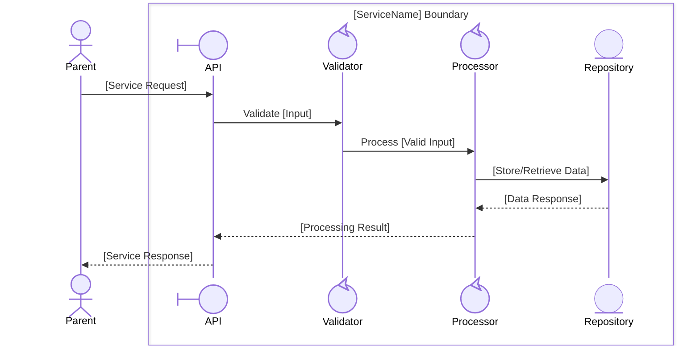
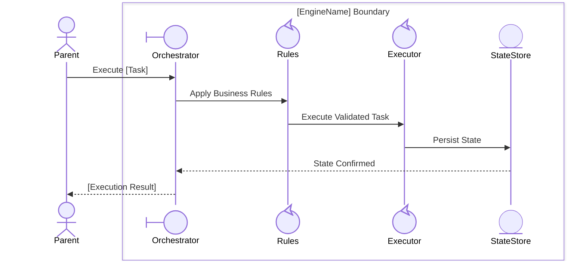
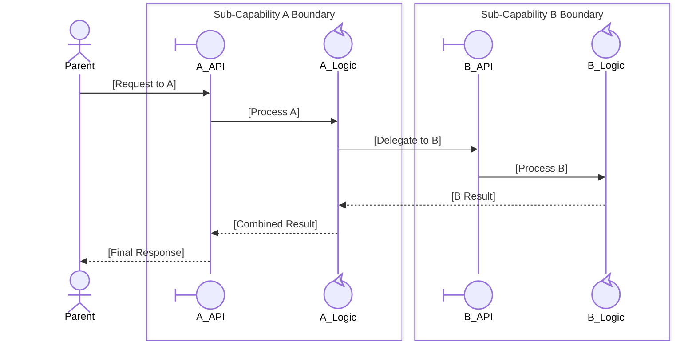
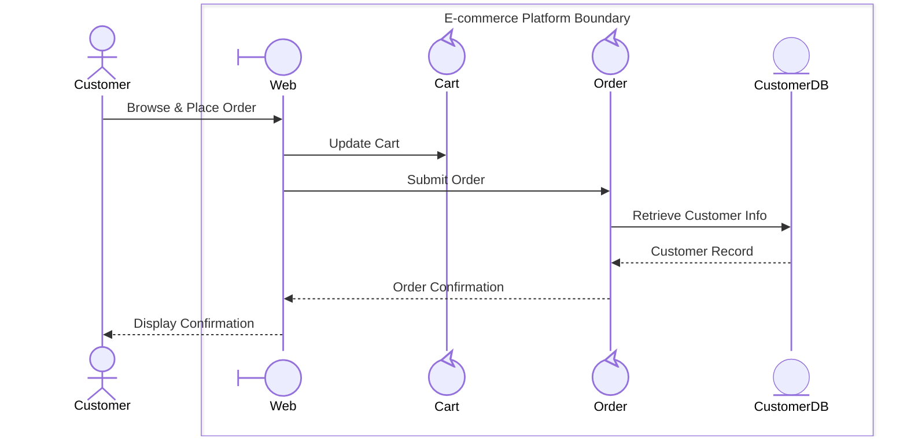
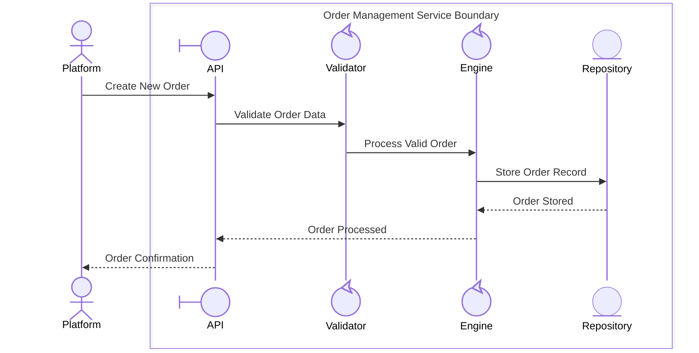

# Decomposition Patterns

## Table of Contents
1. [Participant Inference for New Sub-Processes](#participant-inference-for-new-sub-processes)
2. [Pattern A: Service / Orchestrator Decomposition](#pattern-a-service--orchestrator-decomposition)
3. [Pattern B: Engine / Processor Decomposition](#pattern-b-engine--processor-decomposition)
4. [Pattern C: Multi-Boundary Decomposition](#pattern-c-multi-boundary-decomposition)
5. [Level-by-Level Worked Examples](#level-by-level-worked-examples)
6. [Naming Conventions](#naming-conventions)

---

## Participant Inference for New Sub-Processes

When the user does not specify what participants to add inside the new sub-process, infer them from:

1. **Messages in the parent diagram involving the participant** — any message sent to or from the participant becomes a clue about what logic it encapsulates
2. **Participant name heuristics** — see table below
3. **Domain concepts** — if `domain-concepts.json` or `requirements.json` is available, search for entities related to the participant's name
4. **Direct user specification** — always prefer explicit user input over inference

### Name Heuristic Table

| Participant Name Contains | Likely Boundary Entry Point | Likely Controls | Likely Entities |
|--------------------------|----------------------------|-----------------|-----------------|
| `Service`, `Manager` | `[Name]API` or `[Name]Interface` | `[Name]Processor`, `[Name]Coordinator` | `[Name]Repository`, `[Name]Store` |
| `Engine`, `Processor` | `[Name]Orchestrator` | `[Name]Rules`, `[Name]Executor` | `[Name]State`, `[Name]Log` |
| `Gateway`, `Proxy` | `[Name]Endpoint` | `[Name]Router`, `[Name]Transformer` | `[Name]Cache`, `[Name]Audit` |
| `Platform`, `System` | `[Name]API` | Multiple domain services | Domain data stores |
| `Controller` | `[Name]Dispatcher` | `[Name]Handler`, `[Name]Validator` | `[Name]Registry` |

Prefer 3–5 participants total in a new sub-process for clarity. Add more only if the domain clearly warrants it.

---

## Pattern A: Service / Orchestrator Decomposition

**When**: The decomposed participant's name ends in `Service`, `Manager`, or contains orchestration semantics.

**Sub-process structure:**



---

## Pattern B: Engine / Processor Decomposition

**When**: The decomposed participant's name ends in `Engine`, `Processor`, `Executor`, or `Rules`.

**Sub-process structure:**



---

## Pattern C: Multi-Boundary Decomposition

**When**: The decomposed participant orchestrates multiple distinct sub-capabilities (e.g., a Platform with multiple sub-systems).

Each sub-capability is NOT nested inside the same box; instead generate multiple box boundaries in the Level N+1 diagram, one per sub-capability.



Note: With multiple boundaries, each is a candidate for further decomposition independently.

---

## Level-by-Level Worked Examples

### Level 0 → Level 1: Decomposing `ECommercePlatform` (control)

**Parent (Level 0):**
```
Customer (actor) ->> ECommercePlatform (control): Place Order
```

**New Level 1 sub-process (01-EcommercePlatformBoundary/collaboration.md):**


---

### Level 1 → Level 2: Decomposing `OrderService` (control)

**Parent (Level 1):** `Order Management Service` inside E-commerce Platform

**New Level 2 sub-process (01-OrderManagementBoundary/collaboration.md):**


---

### Level 2 → Level 3: Decomposing `OrderEngine` (control)

**Parent (Level 2):** `Order Processing Engine` inside Order Management Service

**New Level 3 sub-process (01-OrderProcessingEngineBoundary/collaboration.md):**

```mermaid
sequenceDiagram
    participant OrderService@{ "type": "actor", "label": "Order Management Service" }

    box Order Processing Engine Boundary
        participant Workflow@{ "type": "boundary", "label": "Workflow Orchestrator" }
        participant Rules@{ "type": "control", "label": "Business Rules Engine" }
        participant Calculator@{ "type": "control", "label": "Price Calculator" }
        participant StateStore@{ "type": "entity", "label": "Order State" }
    end

    OrderService->>Workflow: Process Order Request
    Workflow->>Rules: Validate Business Rules
    Rules->>Calculator: Calculate Order Total
    Calculator->>StateStore: Update Order State
    StateStore-->>Workflow: State Updated
    Workflow-->>OrderService: Processing Complete
```


---

## Naming Conventions

### Sub-Folder Names
- Pattern: `[NN]-[ParticipantPascalCase]Boundary`
- NN = two-digit ordinal (01, 02, … 10, 11, …)
- PascalCase: remove spaces and special characters from participant label
- Examples:
  - `OrderService` → `01-OrderServiceBoundary`
  - `E-commerce Platform` → `01-EcommercePlatformBoundary`
  - `CPU` → `02-CPUBoundary`

### Participant Short Names (in Mermaid `participant` declarations)
- Use abbreviated PascalCase without spaces: `OrderAPI`, `TxProcessor`, `CustomerDB`
- Keep to ≤ 15 characters for readability
- Must be unique within a diagram

### Box Names
- Pattern: `[ParticipantLabel] Boundary`
- Use Title Case
- Omit `Boundary` suffix only when the name is naturally scoped (e.g., `E-commerce Platform`)
