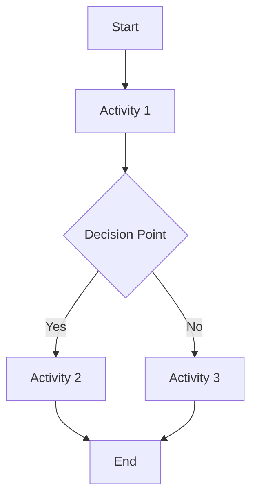
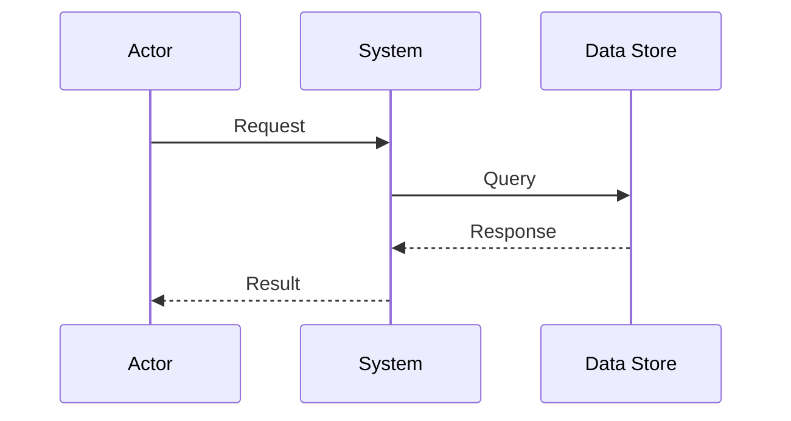
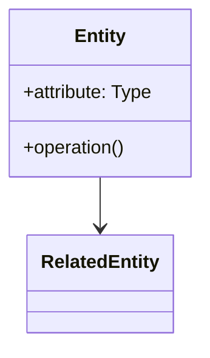

# OrgModel Update

Systematically manages updates to organizational model documents and folder structures based on analysis outputs from requirements processing and domain modeling.

## Intent
Maintain the orgModel hierarchy with systematic updates to process documentation, domain models, collaboration diagrams, and test cases. Ensures organizational models remain current with evolving requirements while preserving existing content structure and maintaining cross-reference integrity.

## Scope and Pipeline Position

**Trigger**: Project analysis outputs — domain concept extraction ([domain-extractconcepts](../domain-extractconcepts/SKILL.md)), entity alignment ([domain-alignentities](../domain-alignentities/SKILL.md)), and collaboration diagram data ([diagram-generatecollaboration](../diagram-generatecollaboration/SKILL.md)).

**Primary inputs**: `domain-alignment.json` / `domain-concepts.json` from the project analysis phase.

**Operates at**: The orgModel process folder level (e.g., `orgModel/01 - Skill Development Process/`). Does **not** recurse into per-hierarchy-node sub-folders created by `hierarchy-management`.

### Relative to `documentation-automation`

| Skill | Trigger | Primary Input | Owns |
|-------|---------|---------------|------|
| `documentation-automation` | Hierarchy decomposition event | `[folder]/collaboration.md` | `main.md`, `process.md`, `collaboration.md`, `domain-model.md` at each EDPS hierarchy node |
| `orgmodel-update` *(this skill)* | Project analysis outputs | `domain-alignment.json`, `domain-concepts.json` | `vocabulary.md`, `test-case-list.md` (always); shared files only in non-hierarchy-managed folders |

**Ordering rule**: Within a single process:
- `documentation-automation` always runs after `hierarchy-management` decomposition and owns the four shared files in each hierarchy node.
- `orgmodel-update` runs from project analysis outputs at the org-model process level.
- If both skills target the same folder, **`documentation-automation` takes precedence** for the four shared files (`main.md`, `process.md`, `collaboration.md`, `domain-model.md`). `orgmodel-update` must not silently overwrite hierarchy-aware navigation, breadcrumbs, or box-syntax diagrams.
- `orgmodel-update` always owns and updates `vocabulary.md` and `test-case-list.md` regardless of hierarchy status, as these files are **not** generated by `documentation-automation`.

**Pipeline overview**:
```
hierarchy-management → documentation-automation → [hierarchy node files per node]

domain-extractconcepts ┐
domain-alignentities   ├─→ orgmodel-update ─→ vocabulary.md, test-case-list.md (always)
                       │                  └─→ pending-orgmodel-updates.md  (if EDPS-hierarchy-managed folder)
                       └─→ [normal file generation if no hierarchy-metadata.json]
```

## Inputs
- **Primary**: `projects/[project-name]/artifacts/Analysis/domain-concepts.json` (from domain-extractconcepts skill)
- **Secondary**: `projects/[project-name]/artifacts/Analysis/domain-alignment.json` (from domain-alignentities skill)
- **Tertiary**: `projects/[project-name]/artifacts/Analysis/collaboration-diagrams.json` (from diagram-generatecollaboration skill)
- **Context**: `projects/[project-name]/artifacts/Analysis/requirements.json` (for traceability)
- **Existing**: `orgModel/[NN] - [Process Name]/` (existing organizational model content)
- **Diagram Updates**: Class diagram updates triggered by domain alignment results

## Outputs
**Files Updated/Generated:**
- `orgModel/[NN] - [Process Name]/main.md` - Updated process overview with new elements
- `orgModel/[NN] - [Process Name]/domain-model.md` - Updated domain model with aligned entities
- `orgModel/[NN] - [Process Name]/process.md` - Updated process flow documentation  
- `orgModel/[NN] - [Process Name]/collaboration.md` - Updated collaboration diagrams
- `orgModel/[NN] - [Process Name]/vocabulary.md` - Updated terminology consistency mapping
- `orgModel/[NN] - [Process Name]/test-case-list.md` - Updated test case master list
- `projects/[project-name]/artifacts/Analysis/orgmodel-update-summary.md` - Change summary and validation report

### Update Summary Structure (`orgmodel-update-summary.md`)
```markdown
# OrgModel Update Summary

**Project**: [Project Name]  
**Generated**: [ISO8601 timestamp]  
**Process Model**: [NN] - [Process Name]  
**Source Analysis**: [source file references]

## Changes Applied

### Structure Updates
- [ ] Created new orgModel folder: `orgModel/[NN] - [Process Name]/`
- [ ] Updated existing structure with [N] new elements
- [ ] Preserved [N] existing elements

### Document Updates
- [ ] **main.md**: [summary of changes]
- [ ] **domain-model.md**: Added [N] entities, [N] concepts
- [ ] **process.md**: Updated with [N] new activities/flows  
- [ ] **collaboration.md**: Added [N] new interaction patterns
- [ ] **vocabulary.md**: Added [N] terms, aligned [N] existing terms
- [ ] **test-case-list.md**: Added [N] test cases, updated [N] existing

### Validation Results
- [ ] Cross-reference integrity maintained
- [ ] Terminology consistency verified
- [ ] Process flow completeness validated
- [ ] Test coverage assessment completed

## Next Steps
- Review updated orgModel for completeness
- Validate process flows with stakeholders
- Update dependent organizational models
- Schedule integration testing
```

## Core Functions

### 1. OrgModel Structure Management

**Create/Update Process Folder**
```
orgModel/[NN] - [Process Name]/
├── main.md               # Process overview with navigation
├── domain-model.md       # Actors, systems, entities from domain analysis
├── process.md            # Process flows, activities, decision points
├── collaboration.md      # Entity interactions and sequence diagrams  
├── vocabulary.md         # Canonical terminology mapping
├── test-case-list.md     # Comprehensive test case registry
└── test-cases/           # Individual test case files (if testing required)
    └── tc-[proc-id]-[sequence].md
```

**Numbering Convention**: Use next available NN sequence number in orgModel folder structure

### 2. Content Generation Patterns

#### main.md Structure
```markdown
<!-- Identifier: I-[NN] -->

# [NN] - [Process Name]

## Purpose
[Business purpose derived from requirements analysis]

## Process Flow  
See [process.md](process.md) for detailed activity diagram.

## Collaborations
See [collaboration.md](collaboration.md) for entity interactions.

## Domain Model
See [domain-model.md](domain-model.md) for actors and entities.

## Sub-Processes
[List nested processes identified from analysis]

## Test Coverage
See [test-case-list.md](test-case-list.md) for verification test cases.

## Related Changes
<!-- Traceability to source requirements and changes -->
```

#### domain-model.md Structure  
```markdown
<!-- Identifier: DM-[NN] -->

# Domain Model: [Process Name]

## Actors
[Human and system actors from domain analysis]

### [Actor Name]
- **Type**: Human/System/External
- **Responsibilities**: [key responsibilities]
- **Interactions**: [primary entity interactions]

## Key Entities
[Business entities from domain concepts extraction]

### [Entity Name] 
- **Definition**: [entity definition]
- **Attributes**: [key attributes]
- **Relationships**: [entity relationships]
- **Domain Area**: [functional area]

## Systems and Components
[Technical systems involved in process]

### [System Name]
- **Purpose**: [system role]
- **Interfaces**: [external connections]
- **Key Functions**: [primary capabilities]
```

#### process.md Structure
```markdown
<!-- Identifier: P-[NN] -->

# Process: [Process Name]

## Overview
[Process purpose and scope]

## Process Flow



## Activities

### [Activity Name]
- **Input**: [required inputs]
- **Process**: [activity description]
- **Output**: [produced outputs]
- **Responsible**: [actor/role responsible]
- **Validation**: [quality checks]

## Decision Points
[Critical decision points with criteria]

## Exception Handling  
[Error conditions and recovery procedures]
```

#### collaboration.md Structure
```markdown
<!-- Identifier: C-[NN] -->

# Collaboration: [Process Name]

## Entity Interactions



## Interaction Patterns
[Description of key interaction patterns]

## Communication Channels
[How entities communicate]

## Data Flow
[Information flow between entities]
```

#### vocabulary.md Structure
```markdown
<!-- Identifier: V-[NN] -->

# Vocabulary: [Process Name]

## Canonical Terms
[Standardized terminology for the process]

| Term | Definition | Aliases | Context |
|------|------------|---------|---------|
| [Term] | [Definition] | [Synonyms] | [Usage context] |

## Domain Alignment
[Mapping to enterprise domain models]

## Consistency Rules
[Guidelines for term usage across process]
```

#### test-case-list.md Structure
```markdown
<!-- Identifier: TCL-[NN] -->

# Test Case List: [Process Name]

## Test Coverage Overview
[Summary of testing scope and approach]

## Test Cases

| TC ID | Test Category | Title | Priority | Source Requirement |
|-------|---------------|-------|----------|-------------------|
| tc-[NN]-001 | Functional | [Test title] | High | R-[ID] |

## Test Categories
- **Functional**: Core process functionality
- **Integration**: Cross-entity interactions  
- **Exception**: Error handling and recovery
- **Performance**: Process efficiency measures
- **Compliance**: Regulatory/standards adherence

## Validation Criteria
[Process success criteria for testing]
```

### 3. Content Update Logic

**Preservation Strategy**:
- Maintain existing content structure and identifiers
- Add new elements without disrupting existing cross-references
- Preserve manual customizations and annotations
- Update metadata and change tracking

**Integration Patterns**:
- Merge new domain entities with existing domain models
- Append new process activities to existing flows
- Integrate new collaboration patterns with existing interactions
- Add new terminology while maintaining consistency
- Extend test coverage without duplicating existing cases

### Domain Model Updates with Class Diagrams
When updating `domain-model.md`, this skill now integrates with diagram generation:

#### Class Diagram Integration Process
1. **Extract existing entities** from textual domain model descriptions
2. **Apply alignment results** from domain-alignentities skill
3. **Generate/update class diagram** reflecting aligned domain structure
4. **Embed diagram** in domain-model.md following organizational patterns
5. **Sync diagram with textual descriptions** to ensure consistency

#### domain-model.md Enhanced Structure
```markdown
<!-- Identifier: D-[NN] -->

# [Process Name] Domain Model

## Domain Class Diagram



## Actors
[Textual descriptions of actors shown in diagram]

## Core Entities  
[Textual descriptions of entities with attributes and operations]

## Key Relationships
[Textual descriptions of relationships shown in diagram]
```

#### Diagram-Text Synchronization
- **Entity alignment**: Ensure diagram entities match textual descriptions
- **Attribute consistency**: Sync diagram attributes with detailed attribute lists  
- **Operation alignment**: Match diagram operations with described behaviors
- **Relationship validation**: Verify diagram associations match textual relationships
- **Styling consistency**: Apply organizational diagram styling standards with proper classDef definitions
- **Style preservation**: Maintain standard organizational colors (actor: #e1f5fe, entity: #f3e5f5, enum: #fff3e0, ai: #e8f5e8)

### 4. Validation and Integrity Checks

**Integration with Diagram Generation**:
- **Trigger diagram updates** when domain alignment results indicate changes
- **Coordinate with diagram-generatecollaboration** skill for class diagram generation
- **Maintain diagram version consistency** across organizational models
- **Preserve custom diagram styling** and layout preferences
- **Ensure styling definitions included** - All class diagrams must include classDef statements for proper rendering
- **Validate diagram syntax** - Check that both inline styling (:::category) and style definitions (classDef) are present

**Cross-Reference Validation**:
- Verify all internal links to process documents remain valid
- Ensure terminology consistency across all orgModel files
- Validate entity references between domain model and collaborations
- Check test case traceability to source requirements

**Structure Integrity**:
- Confirm file naming conventions compliance
- Validate Mermaid diagram syntax in process.md and collaboration.md
- Ensure required sections present in all core files
- Verify identifier uniqueness across orgModel structure

**Content Consistency**:
- Align terminology with vocabulary.md across all files
- Ensure actor consistency between domain-model.md and collaboration.md
- Validate process flow completeness and logical consistency
- Check test case coverage against identified process activities

### 5. EDPS-Hierarchy Guard

> **Purpose**: Prevent `orgmodel-update` from silently overwriting hierarchy-aware content (breadcrumbs, Sub-Processes tables, box-syntax diagrams) that was generated or managed by `documentation-automation`.

#### Guard Algorithm (run before writing `main.md`, `process.md`, `collaboration.md`, or `domain-model.md`)

1. For each target orgModel folder, search for `hierarchy-metadata.json` in:
   - The folder itself
   - Up to 3 ancestor levels within `orgModel/` (e.g., `../`, `../../`, `../../../`)
2. **If `hierarchy-metadata.json` IS found** → folder is EDPS-hierarchy-managed:
   - **Do NOT generate** `main.md`, `process.md`, `collaboration.md`, or `domain-model.md` directly.
   - Instead, write all proposed additions (new domain entities, aligned concepts, process notes) to `[folder]/pending-orgmodel-updates.md` using the format below.
   - Log a recommendation: *"Re-run `documentation-automation` with the updated `domain-concepts.json` as context to incorporate these changes into the hierarchy-managed files."*
   - **Exception — `--force-overwrite` flag**: When `orgmodel-update` is invoked with `--force-overwrite`, skip the guard and overwrite all files unconditionally. Use only for deliberate full regeneration in controlled workflows.
3. **If `hierarchy-metadata.json` is NOT found** → generate all files normally per existing behavior.
4. **Exempt files** — `vocabulary.md` and `test-case-list.md` are **always updated directly** regardless of guard outcome (step 2 or 3). These files are not generated by `documentation-automation`.

#### `pending-orgmodel-updates.md` Format

```markdown
# Pending OrgModel Updates

**Folder**: `orgModel/[NN] - [Process Name]/`
**Generated**: [ISO8601 timestamp]
**Source Analysis**: [path to domain-concepts.json and/or domain-alignment.json used as input]
**Guard Triggered By**: `hierarchy-metadata.json` found at `[path]`

> ⚠ This folder is managed by an EDPS hierarchy. The four shared files (`main.md`, `process.md`,
> `collaboration.md`, `domain-model.md`) were NOT overwritten. Apply the additions below manually,
> or re-run `documentation-automation --force` with the domain-concepts.json listed above as context.

## Proposed Additions

### New Domain Entities
| Entity | Definition | Domain Area | Source |
|--------|------------|-------------|--------|
| [EntityName] | [definition] | [area] | [source file ref] |

### New Vocabulary Terms
| Term | Definition | Aliases | Context |
|------|------------|---------|----------|
| [Term] | [definition] | [synonyms] | [usage context] |

### Process Notes
- [Any process flow additions or clarifications from the analysis]

## Human Action Required

- [ ] Review proposed additions above
- [ ] Merge applicable entities into `domain-model.md`
- [ ] Merge applicable terms into `vocabulary.md` (or confirm auto-update is sufficient)
- [ ] Re-run `documentation-automation` if structural changes to `process.md` or `collaboration.md` are needed
- [ ] Delete this file once all items are resolved
```

## Usage Guidelines

### Typical Workflow
1. **Analyze Input**: Process domain concepts, alignment results, and collaboration diagrams
2. **Identify Target**: Determine orgModel process (existing or new) for updates
3. **EDPS-Hierarchy Guard Check** *(before any shared-file generation)*: For each target orgModel folder, run the guard algorithm in §Core Functions → §5 EDPS-Hierarchy Guard before writing `main.md`, `process.md`, `collaboration.md`, or `domain-model.md`. `vocabulary.md` and `test-case-list.md` are always updated — skip the guard for those files.
4. **Structure Update**: Create/modify orgModel folder structure as needed (only if not blocked by guard in step 3)
5. **Content Integration**: Update each core file with new elements, preserving existing content
6. **Validation**: Run integrity checks and cross-reference validation
7. **Summary Generation**: Document all changes and validation results

### Integration Points
- **Domain Analysis**: Incorporates entities and concepts from domain extraction
- **Process Modeling**: Integrates with collaboration diagram generation
- **Requirements Traceability**: Maintains links to source requirements
- **Change Management**: Documents updates for organizational tracking
- **Testing Integration**: Provides test case foundation for validation activities

### Quality Assurance
- Apply organizational naming conventions consistently
- Ensure Mermaid diagram syntax validity
- Maintain document template compliance
- Validate cross-reference integrity
- Confirm terminology alignment with enterprise standards

## Related Skills

| Skill | Relationship |
|-------|-------------|
| `documentation-automation` | **Upstream / higher precedence for shared files**. Triggered by `hierarchy-management` decomposition; owns `main.md`, `process.md`, `collaboration.md`, `domain-model.md` in hierarchy-managed folders. `orgmodel-update` defers to `documentation-automation` for those files when `hierarchy-metadata.json` is present. See `documentation-automation/SKILL.md` for its scope. |
| `domain-extractconcepts` | Provides `domain-concepts.json` — the primary input for this skill |
| `domain-alignentities` | Provides `domain-alignment.json` — the secondary input for entity alignment |
| `diagram-generatecollaboration` | Provides `collaboration-diagrams.json`; also validates EDPS boundary rules referenced in collaboration.md updates |
| `hierarchy-management` | Creates folder structure and `hierarchy-metadata.json`; presence of that file activates the EDPS-Hierarchy Guard in this skill |

## Configuration Options

### Process Identification
- **Auto-numbering**: Automatically assign next available orgModel sequence number
- **Manual numbering**: Use specified process number for updates
- **Name mapping**: Map requirements/domain areas to existing process models

### Update Mode
- **Incremental**: Add new elements to existing orgModel content
- **Refresh**: Regenerate orgModel content while preserving customizations
- **Merge**: Combine multiple analysis sources into single orgModel update

### Validation Level
- **Basic**: File structure and syntax validation
- **Standard**: Cross-reference and consistency checking  
- **Comprehensive**: Full integrity validation with dependency analysis

---

**Dependencies**: domain-extractconcepts, domain-alignentities, diagram-generatecollaboration
**Integration**: GitHub Copilot, VS Code environment, EDPS skill framework, Mermaid class diagram generation
**Maintenance**: Update templates based on organizational model evolution
**Diagram Support**: Automatic class diagram generation and synchronization with textual domain models