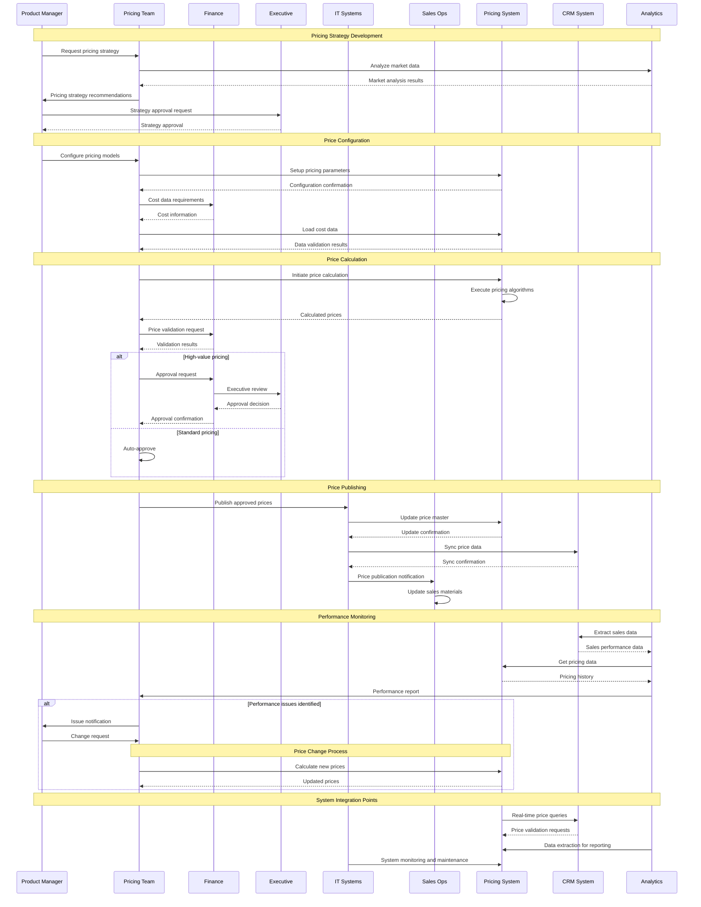

# Pricing Process Collaboration Diagram

## Collaboration Patterns

### Strategy Development Collaboration
**Participants**: Product Manager, Pricing Team, Analytics, Executive
**Interaction Type**: Sequential workflow with feedback loops
**Communication**: Formal documents, presentations, approval workflows
**Frequency**: Quarterly or as needed for new initiatives

### Operational Pricing Collaboration  
**Participants**: Pricing Team, Pricing System, Finance, IT
**Interaction Type**: High-frequency transactional
**Communication**: System interfaces, automated workflows
**Frequency**: Daily operations

### Cross-System Integration
**Participants**: Pricing System, CRM, Analytics, IT Systems
**Interaction Type**: Real-time data synchronization
**Communication**: APIs, data feeds, event notifications
**Frequency**: Continuous

### Approval and Governance
**Participants**: Finance, Executive, Pricing Team
**Interaction Type**: Approval workflows with escalation
**Communication**: Formal approval processes, documentation
**Frequency**: As needed based on pricing thresholds

## Key Integration Points

### Pricing System ↔ CRM System
- **Purpose**: Real-time price queries and validation
- **Method**: REST API calls
- **Frequency**: Per transaction
- **Data**: Product prices, customer-specific pricing

### Analytics ↔ Multiple Systems
- **Purpose**: Performance monitoring and reporting
- **Method**: Data extraction and ETL processes
- **Frequency**: Daily/weekly batch processes
- **Data**: Sales data, pricing history, performance metrics

### IT Systems ↔ Pricing System
- **Purpose**: System administration and monitoring
- **Method**: Administrative interfaces and monitoring tools
- **Frequency**: Continuous monitoring
- **Data**: System health, performance metrics, configuration

## Error Handling Patterns

### System Failure Recovery
1. **Detection**: Automated monitoring alerts
2. **Notification**: IT team and business stakeholders
3. **Response**: Failover procedures or manual processes
4. **Resolution**: System restoration and validation

### Data Consistency Issues
1. **Detection**: Data validation checks and reconciliation
2. **Notification**: Data stewards and business users
3. **Response**: Data correction procedures
4. **Resolution**: System synchronization and verification

### Approval Process Exceptions
1. **Detection**: Approval timeout or rejection
2. **Notification**: Requesting party and management
3. **Response**: Escalation or alternative approval path
4. **Resolution**: Process completion and documentation

---
*Collaboration model updated: March 15, 2026*