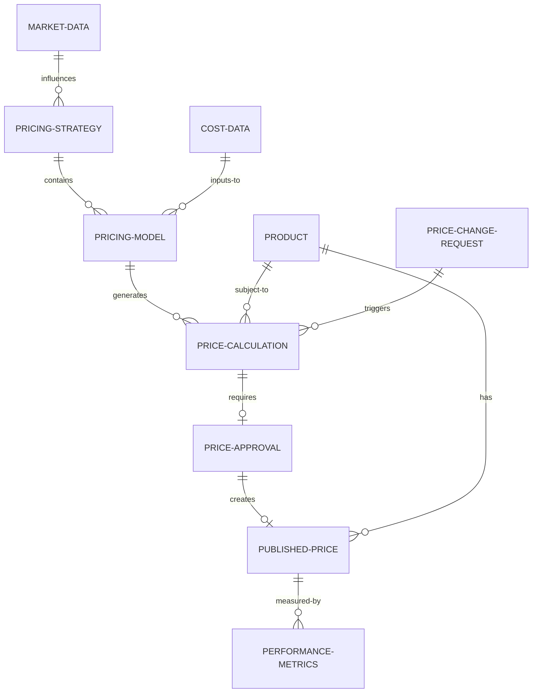

# Pricing Process Domain Model

## Actors

### Internal Actors

#### Product Manager
- **Role**: Strategic pricing oversight and product lifecycle management
- **Responsibilities**: 
  - Define pricing strategy for product lines
  - Approve pricing policy changes
  - Coordinate with market research and competitive analysis
- **Authority Level**: Strategic decisions, budget approval
- **Systems Access**: Pricing System (read/configure), Analytics (read)

#### Pricing Team
- **Role**: Operational pricing management and analysis
- **Responsibilities**:
  - Execute pricing calculations and modeling
  - Maintain pricing configurations and parameters
  - Analyze pricing performance and recommend adjustments
- **Authority Level**: Operational execution, standard pricing approval
- **Systems Access**: Pricing System (full access), Analytics (read/write)

#### Finance Team
- **Role**: Financial validation and high-value pricing approval
- **Responsibilities**:
  - Validate pricing against financial targets
  - Approve high-value or strategic pricing decisions
  - Provide cost data and margin analysis
- **Authority Level**: Financial approval, cost validation
- **Systems Access**: Pricing System (read/approve), Financial Systems (full)

#### Executive Leadership
- **Role**: Strategic oversight and final approval authority
- **Responsibilities**:
  - Approve strategic pricing initiatives
  - Set organizational pricing policies
  - Resolve escalated pricing decisions
- **Authority Level**: Ultimate approval authority
- **Systems Access**: Executive dashboards (read), approval workflows

#### Sales Operations
- **Role**: Pricing implementation and sales enablement
- **Responsibilities**:
  - Implement approved pricing in customer-facing systems
  - Maintain pricing documentation and training materials
  - Coordinate pricing communications with sales teams
- **Authority Level**: Implementation execution
- **Systems Access**: CRM Systems (read/write), Pricing System (read)

#### IT Operations
- **Role**: System maintenance and technical support
- **Responsibilities**:
  - Maintain pricing system infrastructure
  - Implement system integrations
  - Provide technical support and monitoring
- **Authority Level**: System administration
- **Systems Access**: All systems (administrative access)

### External Actors

#### Customers
- **Role**: Price consumers and feedback providers
- **Responsibilities**:
  - Receive pricing information
  - Provide market feedback on pricing effectiveness
- **Authority Level**: None (information recipient)
- **Systems Access**: Customer portals (read-only pricing views)

#### Regulatory Bodies
- **Role**: Compliance oversight and regulation
- **Responsibilities**:
  - Monitor pricing compliance with regulations
  - Audit pricing practices and documentation
- **Authority Level**: Regulatory enforcement
- **Systems Access**: Audit interfaces (read-only)

## Core Entities

### Pricing Strategy
- **Description**: High-level framework defining pricing approach and objectives
- **Attributes**:
  - Strategy ID, Name, Description
  - Effective Date Range
  - Target Market Segments
  - Pricing Objectives (revenue, margin, market share)
  - Competitive Positioning
- **Relationships**: Contains multiple Pricing Models

### Pricing Model
- **Description**: Specific methodology and rules for calculating prices
- **Attributes**:
  - Model ID, Name, Type (cost-plus, value-based, competitive)
  - Calculation Algorithm
  - Parameters and Variables
  - Approval Requirements
  - Version Information
- **Relationships**: Belongs to Pricing Strategy, generates Price Calculations

### Product
- **Description**: Item or service being priced
- **Attributes**:
  - Product ID, Name, Description
  - Product Category, Family
  - Cost Information
  - Lifecycle Stage
  - Competitive Position
- **Relationships**: Subject to Pricing Models, has Price History

### Price Calculation
- **Description**: Specific price determination for a product under defined conditions
- **Attributes**:
  - Calculation ID
  - Product ID, Model ID
  - Input Parameters
  - Calculated Price
  - Calculation Timestamp
  - Validation Status
- **Relationships**: References Product and Pricing Model

### Price Approval
- **Description**: Formal approval decision for pricing recommendations
- **Attributes**:
  - Approval ID
  - Calculation ID
  - Approver Information
  - Approval Status (pending, approved, rejected)
  - Approval Timestamp
  - Comments/Rationale
- **Relationships**: Approves Price Calculations

### Published Price
- **Description**: Officially published and active price for a product
- **Attributes**:
  - Price ID
  - Product ID
  - Price Value
  - Currency
  - Effective Date Range
  - Publication Timestamp
  - Status (active, expired, superseded)
- **Relationships**: Derived from approved Price Calculations

### Price Change Request
- **Description**: Formal request to modify existing pricing
- **Attributes**:
  - Request ID
  - Product ID, Current Price ID
  - Requested Changes
  - Business Justification
  - Impact Analysis
  - Request Status
- **Relationships**: May generate new Price Calculations

## Supporting Entities

### Market Data
- **Description**: External market intelligence informing pricing decisions
- **Attributes**:
  - Data Source, Collection Date
  - Market Segment Information
  - Competitive Pricing Intelligence
  - Market Conditions
- **Relationships**: Influences Pricing Strategies and Models

### Cost Data
- **Description**: Product cost information used in pricing calculations
- **Attributes**:
  - Cost Type (material, labor, overhead)
  - Cost Value, Currency
  - Effective Date
  - Cost Center Information
- **Relationships**: Input to Pricing Models

### Performance Metrics
- **Description**: Measurements of pricing effectiveness and outcomes
- **Attributes**:
  - Metric Type (revenue, margin, volume)
  - Measurement Value
  - Time Period
  - Product/Segment Scope
- **Relationships**: Measures effectiveness of Published Prices

## Entity Relationships

## Domain Constraints

### Business Rules
1. **Price Approval Thresholds**: Prices above defined thresholds require executive approval
2. **Effective Date Validation**: Published prices cannot have overlapping effective periods
3. **Cost Coverage**: Calculated prices must cover minimum cost thresholds
4. **Competitive Boundaries**: Prices must align with competitive positioning strategy

### Data Integrity Rules
1. **Historical Preservation**: Price history must be maintained and immutable
2. **Audit Trail**: All pricing decisions must have complete approval documentation
3. **Calculation Reproducibility**: Price calculations must be reproducible from stored parameters
4. **Version Control**: Pricing models must maintain version history

### System Constraints
1. **Performance Requirements**: Price calculations must complete within defined time limits
2. **Availability Requirements**: Pricing system must maintain specified uptime
3. **Security Requirements**: Pricing data access must follow role-based security model
4. **Integration Requirements**: Price changes must synchronize across all connected systems

---
*Domain model updated: March 15, 2026*