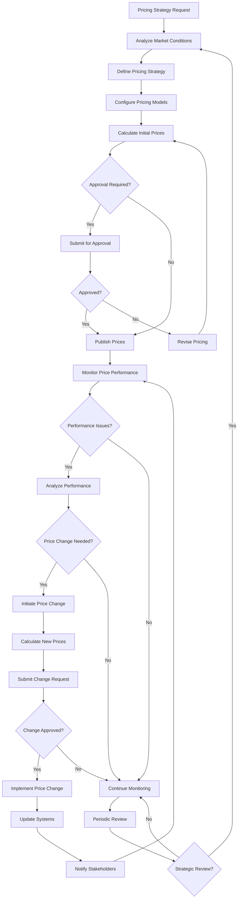

# Pricing Process Activity Diagram

## Process Description

### Phase 1: Pricing Strategy Development
**Activities**: Market analysis, competitive research, strategy formulation
**Inputs**: Market data, business objectives, competitive intelligence
**Outputs**: Pricing strategy document, pricing policies
**Responsible**: Product Management, Marketing
**Duration**: Varies by complexity

### Phase 2: Price Configuration
**Activities**: Model setup, parameter configuration, calculation rules definition
**Inputs**: Pricing strategy, product specifications, cost data
**Outputs**: Configured pricing models, calculation parameters
**Responsible**: Business Analysts, Pricing Team
**Duration**: 1-2 weeks typically

### Phase 3: Price Calculation
**Activities**: Run pricing calculations, validate results, perform quality checks
**Inputs**: Configured models, product data, market conditions
**Outputs**: Calculated prices, price lists, validation reports
**Responsible**: Pricing Team, Finance
**Duration**: Hours to days depending on complexity

### Phase 4: Price Approval
**Activities**: Review pricing recommendations, assess business impact, approve or reject
**Inputs**: Calculated prices, business justification, impact analysis
**Outputs**: Approved prices, approval documentation
**Responsible**: Finance, Executive Leadership
**Duration**: 1-5 business days

### Phase 5: Price Publishing
**Activities**: Update systems, distribute price lists, communicate changes
**Inputs**: Approved prices, system configurations, communication templates
**Outputs**: Published prices, updated systems, stakeholder notifications
**Responsible**: IT Operations, Sales Operations
**Duration**: 1-2 days

### Phase 6: Performance Monitoring
**Activities**: Track price performance, analyze metrics, identify issues
**Inputs**: Sales data, market feedback, performance metrics
**Outputs**: Performance reports, issue identification, recommendations
**Responsible**: Analytics Team, Business Intelligence
**Duration**: Ongoing

### Phase 7: Price Change Management
**Activities**: Assess change needs, calculate new prices, implement updates
**Inputs**: Performance analysis, market changes, business requirements
**Outputs**: Updated prices, change documentation, system updates
**Responsible**: Pricing Team, Change Management
**Duration**: Varies by scope

## Decision Points

### Approval Required Gateway
**Criteria**: Price variance thresholds, product categories, customer segments
**Outcomes**: Route to approval workflow or direct to publishing
**Authority**: Business rules configuration

### Performance Issues Gateway
**Criteria**: Sales performance metrics, margin analysis, competitive position
**Outcomes**: Continue monitoring or initiate analysis
**Authority**: Performance thresholds and escalation rules

### Price Change Decision
**Criteria**: Performance impact, market conditions, strategic objectives
**Outcomes**: Implement changes or maintain current pricing
**Authority**: Business impact assessment

## Error Handling
- **Calculation Errors**: Validation checks, error logging, manual review
- **System Failures**: Backup procedures, manual processes, escalation
- **Approval Delays**: Escalation procedures, temporary pricing, communication

## Performance Metrics
- **Pricing Accuracy**: Calculation precision, error rates
- **Approval Cycle Time**: Time from submission to approval
- **Implementation Speed**: Time from approval to live prices
- **Price Effectiveness**: Revenue impact, margin achievement

---
*Process model updated: March 15, 2026*